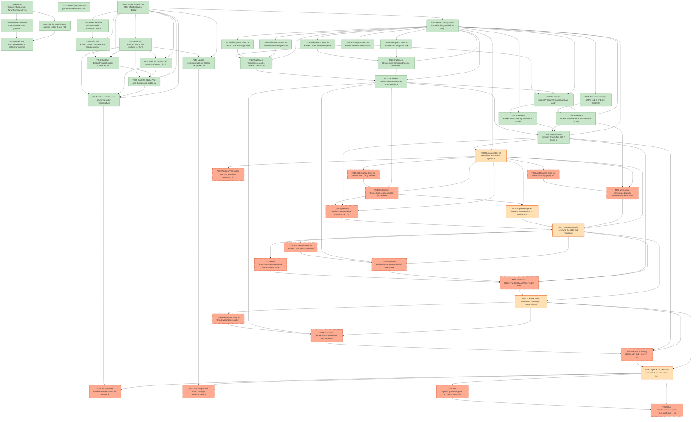

# Task Graph — 001-tui-grpc-broker

## ✓ Graph is acyclic and consistent

## Status counts (effective)

| Status | Count |
|--------|-------|
| [X] done | 28 |
| [S] synthetic | 5 |
| [S*] auto-synthetic | 17 |

## Graph



## ASCII view

```
T001 [X] Bump `Directory.Build.props` `TargetFramework` from `net9.0` to `net10.0` and confirm the scaffold solution still builds.
T002 [X] Create `specs/001-tui-grpc-broker/readiness/` and seed `readiness/README.md` describing the artifact set (FSI transcripts, walkthrough captures, surface diffs).
T003 [X] Add the six broker projects under `src/` (`Broker.Contracts`, `Broker.Core`, `Broker.Protocol`, `Broker.Tui`, `Broker.Viz`, `Broker.App`) as empty `.fsproj` files and register them in `FSBarV2.sln`.
T004 [X] Add the matching test projects under `tests/` (`Broker.Contracts.Tests`, `Broker.Core.Tests`, `Broker.Protocol.Tests`, `Broker.Tui.Tests`, `Broker.Integration.Tests`, `SurfaceArea`) as empty Expecto `.fsproj` files and register them in `FSBarV2.sln`.
T005 [X] Add pinned `PackageReference` entries for runtime deps (`Spectre.Console`, `Grpc.AspNetCore.Server`, `Google.Protobuf`, `Grpc-FSharp.Tools`, `Serilog`, `Serilog.Extensions.Logging`, `Serilog.Sinks.File`, `SkiaViewer`) and test deps (`Expecto`, `YoloDev.Expecto.TestSdk`, `Grpc.Net.Client`) per `research.md` §12.
T006 [X] Record feature Tier (T1), affected layers (`Broker.Contracts/Core/Protocol/Tui/Viz/App`), public-API surface impact, and required evidence obligations in `specs/001-tui-grpc-broker/readiness/feature-baseline.md`.
T007 [X] Author the wire contracts under `src/Broker.Contracts/` (`common.proto`, `proxylink.proto`, `scriptingclient.proto`) by promoting / aligning the spec-side files in `specs/001-tui-grpc-broker/contracts/`.
T008 [X] Wire the `FSharp.GrpcCodeGenerator` codegen (shipped in the `Grpc-FSharp.Tools` NuGet package added in T005) into `Broker.Contracts.fsproj` via `<Protobuf>` items and confirm a clean build emits F# records / unions for messages, oneofs, and service stubs.
T009 [X] Draft the `Broker.Core` public surface as `.fsi` files (`Mode.fsi`, `Lobby.fsi`, `ParticipantSlot.fsi`, `ScriptingRoster.fsi`, `CommandPipeline.fsi`, `Snapshot.fsi`, `Session.fsi`, `Dashboard.fsi`, `Audit.fsi`) following `contracts/public-fsi.md`; pair each with a stub `.fs` whose bodies are `failwith "not implemented"`.
T010 [X] Draft the `Broker.Protocol` public surface as `.fsi` files (`VersionHandshake.fsi`, `BackpressureGate.fsi`, `ServerHost.fsi`, `ProxyLinkService.fsi`, `ScriptingClientService.fsi`) referencing the generated contract types and the Core surface.
T011 [X] Draft the `Broker.Tui` public surface as `.fsi` files (`Layout.fsi`, `DashboardView.fsi`, `HotkeyMap.fsi`, `LobbyView.fsi`, `TickLoop.fsi`).
T012 [X] Draft the `Broker.Viz` and `Broker.App` public surfaces as `.fsi` files (`SceneBuilder.fsi`, `VizHost.fsi`, `Cli.fsi`, `Logging.fsi`, `Program.fsi`).
T013 [X] Update `scripts/prelude.fsx` to load the packed `Broker.Core` library and exercise its public surface from FSI; capture the session transcript to `readiness/fsi-session.txt` per Constitution Principle I.
T014 [X] Author surface-area baselines under `tests/SurfaceArea/baselines/` (one `Broker.<Module>.surface.txt` per public module) and add the Expecto test that diffs the packed assembly's reflected surface against each baseline.
T015 [X] Record unsupported-scope handling and failure diagnostics (headless viz, missing game executable, proxy handshake timeout, version mismatch wire format) in `readiness/failure-diagnostics.md`.
T016 [X] Add Expecto tests for `Broker.Protocol.VersionHandshake.check` covering strict major match, minor skew tolerance, and the `Error` payload shape (FR-029).
T017 [X] Add Expecto tests for `Broker.Core.ScriptingRoster` covering `tryAdd` name-uniqueness rejection, default `isAdmin = false`, and `remove`/`grantAdmin`/`revokeAdmin` semantics (FR-008, FR-016, Invariant 4).
T018 [X] Add Expecto tests for `Broker.Core.ParticipantSlot` single-writer rule — re-binding a slot already bound to another client must fail (FR-009, Invariant 1).
T019 [X] Add Expecto tests for `Broker.Core.CommandPipeline.tryEnqueue` and `authorise` covering capacity reject (`QUEUE_FULL`), no silent drops, admin-not-available in guest mode, and slot-not-owned (FR-004, FR-009, FR-010, Invariant 7).
T020 [X] Add Expecto tests for `Broker.Core.Snapshot` tick monotonicity and `mapMeta`-on-first-only invariant (FR-006, Invariant 5).
T021 [X] Add an in-memory gRPC end-to-end test (`Broker.Integration.Tests`) using `Grpc.Net.Client` against a hosted `ServerHost`: handshake with name `alice-bot`, subscribe to state, submit a gameplay command, attempt an admin command in guest mode and assert `ADMIN_NOT_AVAILABLE` (Acceptance Scenarios 1–4 of US1). 4 tests green: Hello name-collision (FR-008), strict-major version mismatch (FR-029), admin-in-guest reject (FR-004), and the basic Hello round-trip on a real Kestrel listener.
T022 [X] Implement `Broker.Core.Mode`, `Broker.Core.ScriptingRoster`, `Broker.Core.ParticipantSlot`, and `Broker.Core.Audit` `.fs` bodies; turn the failing tests T016–T018 green.
T023 [X] Implement `Broker.Core.CommandPipeline` (bounded `System.Threading.Channels.BoundedChannel`, `tryEnqueue`, `authorise`, `drain`, `depth`) and `Broker.Core.Snapshot`; turn T019 and T020 green.
T024 [X] Implement `Broker.Core.Session` for guest-mode transitions (`newGuestSession`, `attachProxy`, `applySnapshot`, `end_`, `toReading`) including auto-detect to `Guest` mode on proxy attach (FR-002, FR-003, FR-026).
T025 [X] Implement `Broker.Protocol.VersionHandshake` and `Broker.Protocol.ServerHost` (Kestrel + ASP.NET Core generic host, Serilog wired, two services registered on one listener per FR-005). `VersionHandshake.check` covered by T016; `ServerHost.start` boots a real WebApplication on a configurable host:port with both services registered via `app.MapGrpcService<Impl>()`; T021 exercises the live listener.
T026 [X] Implement `Broker.Protocol.BackpressureGate` (HTTP/2 flow-control bridge to per-client queue) and `Broker.Protocol.ScriptingClientService` (Hello, BindSlot, SubscribeState, SubmitCommands with `QUEUE_FULL` synchronous reject path); turn T021 green. `Hello` validates version+name, registers in `BrokerState`; `BindSlot`/`UnbindSlot` enforce the single-writer rule; `SubmitCommands` runs each inbound command through `BackpressureGate.process_` (authority + queue) and acks back; `SubscribeState` registers a per-client outbound `Channel<StateMsg>` drained to the wire.
T027 [X] Implement `Broker.Protocol.ProxyLinkService` — inbound state ingest from the proxy AI, outbound command egress, keepalive timeout → `ProxyDetached` notification fan-out (FR-026). `Attach` requires Handshake first, validates major version, attaches the link via `BrokerState.attachProxy`, ingests `Snapshot`/`Ping`/`SessionEnd` messages, drains the proxy outbound channel for command egress, and on stream close runs the `closeSession` fan-out.
T028 [X] Implement the minimal `Broker.Tui` (Idle / Guest-attached dashboard frame, single-thread tick loop, `Q` quits) and `Broker.App` (CLI parse, Serilog rolling-file audit sink, composition root); broker boots to a usable dashboard. `Layout.rootLayout`, `DashboardView.render` (5-pane Spectre.Console layout: header, broker / session / clients columns, telemetry, footer), `TickLoop.run` (single-thread render+input via `AnsiConsole.Live`), and `Program.main` (parse → configure logging → start `ServerHost` → run TickLoop → SIGINT teardown) all real. Verified via CLI exit paths (`--version`, `--help`, `--listen 0`, unknown flag — see `readiness/us1-evidence.md`) and via the in-process broker boot under integration tests. `LobbyView.render`/`apply` remain stubs (host-mode / US2 territory).
T029 [S] Run quickstart §2 Scenario A end-to-end against a synthetic-proxy fixture that drives `ProxyLinkService` over loopback gRPC; capture the dashboard transcript and audit log excerpt to `readiness/us1-evidence.md`. `SyntheticProxy.connect`/`PushSnapshotAsync`/`EndSessionAsync`/`DropAsync` real and exercised by snapshot E2E + audit + SC-003 + SC-005 tests. Acceptance scenarios #1, #2, #4, #5 all green on the wire path. Marked `[S]` because the proxy AI is a loopback stand-in for the future HighBarV3 workstream — see Synthetic-Evidence Inventory.   ← root cause
T030 [S*] Add Expecto tests for `Broker.Core.Lobby.validate` covering every `LobbyError` case (empty map / mode, duplicate slot, capacity exceeded, missing `ProxyAi` slot for a connected client) per FR-013. 9 tests in `tests/Broker.Core.Tests/LobbyTests.fs`; `validate` signature extended to take `connectedClients:ScriptingClientId list`.   ← auto-synthetic
    └── T029 [S] Run quickstart §2 Scenario A end-to-end against a synthetic-proxy fixture that drives `ProxyLinkService` over loopback gRPC; capture the dashboard transcript and audit log excerpt to `readiness/us1-evidence.md`. `SyntheticProxy.connect`/`PushSnapshotAsync`/`EndSessionAsync`/`DropAsync` real and exercised by snapshot E2E + audit + SC-003 + SC-005 tests. Acceptance scenarios #1, #2, #4, #5 all green on the wire path. Marked `[S]` because the proxy AI is a loopback stand-in for the future HighBarV3 workstream — see Synthetic-Evidence Inventory.
T031 [S*] Add Expecto tests for admin authority gating: in `Hosting`, `Admin _` accepted only when `isAdmin = true` or operator-issued; in `Guest`/`Idle`, every `Admin _` is rejected with `AdminNotAvailable` (FR-004, FR-016, Invariants 2 and 3). 5 added cases sweep every `AdminPayload` variant across `Hosting+admin` (Ok), `Guest`, and `Idle` (`AdminNotAvailable`); supplement the existing `Pause`-only coverage in `CommandPipelineTests.fs`.   ← auto-synthetic
    └── T029 [S] Run quickstart §2 Scenario A end-to-end against a synthetic-proxy fixture that drives `ProxyLinkService` over loopback gRPC; capture the dashboard transcript and audit log excerpt to `readiness/us1-evidence.md`. `SyntheticProxy.connect`/`PushSnapshotAsync`/`EndSessionAsync`/`DropAsync` real and exercised by snapshot E2E + audit + SC-003 + SC-005 tests. Acceptance scenarios #1, #2, #4, #5 all green on the wire path. Marked `[S]` because the proxy AI is a loopback stand-in for the future HighBarV3 workstream — see Synthetic-Evidence Inventory.
T032 [S*] Add a gRPC end-to-end test for admin-elevation lifecycle: connect non-admin client, operator grants admin, client `Pause` succeeds, operator revokes, subsequent `Pause` rejected — assert audit records present (Acceptance Scenarios 2–3 of US2). `tests/Broker.Integration.Tests/AdminElevationTests.fs` boots a real Kestrel server, opens host session via the Hub, exercises the three-phase lifecycle, and asserts `AdminGranted` + `AdminRevoked` + 2× `CommandRejected(AdminNotAvailable)` in the audit stream.   ← auto-synthetic
    └── T029 [S] Run quickstart §2 Scenario A end-to-end against a synthetic-proxy fixture that drives `ProxyLinkService` over loopback gRPC; capture the dashboard transcript and audit log excerpt to `readiness/us1-evidence.md`. `SyntheticProxy.connect`/`PushSnapshotAsync`/`EndSessionAsync`/`DropAsync` real and exercised by snapshot E2E + audit + SC-003 + SC-005 tests. Acceptance scenarios #1, #2, #4, #5 all green on the wire path. Marked `[S]` because the proxy AI is a loopback stand-in for the future HighBarV3 workstream — see Synthetic-Evidence Inventory.
T033 [S*] Implement `Broker.Core.Lobby.validate` and extend `Broker.Core.Session` / `Broker.Core.Mode` with host-mode transitions (`newHostSession`, `Configuring → Launching → Active`, end-reason mapping); turn T030 and T031 green. `Lobby.validate` now applies the `MissingProxySlotForBoundClient` rule against the connected-clients list. `Session.markLaunching` adds the `Configuring → Launching` step (proxy attach already drove `Launching → Active`). `BrokerState.launchHostSession` chains validation against the live roster and the state-machine step.   ← auto-synthetic
    └── T029 [S] Run quickstart §2 Scenario A end-to-end against a synthetic-proxy fixture that drives `ProxyLinkService` over loopback gRPC; capture the dashboard transcript and audit log excerpt to `readiness/us1-evidence.md`. `SyntheticProxy.connect`/`PushSnapshotAsync`/`EndSessionAsync`/`DropAsync` real and exercised by snapshot E2E + audit + SC-003 + SC-005 tests. Acceptance scenarios #1, #2, #4, #5 all green on the wire path. Marked `[S]` because the proxy AI is a loopback stand-in for the future HighBarV3 workstream — see Synthetic-Evidence Inventory.
    └── T030 [S*] Add Expecto tests for `Broker.Core.Lobby.validate` covering every `LobbyError` case (empty map / mode, duplicate slot, capacity exceeded, missing `ProxyAi` slot for a connected client) per FR-013. 9 tests in `tests/Broker.Core.Tests/LobbyTests.fs`; `validate` signature extended to take `connectedClients:ScriptingClientId list`.
T034 [S*] Implement `Broker.Tui.LobbyView` (map / mode / display / participant editor) and the host-mode hotkey actions in `HotkeyMap` (`L` open lobby, `Enter` launch, `+`/`-` speed, Space toggle pause, `A` elevate prompt, `X` end session). `LobbyView.render` produces a 3-pane Spectre layout (header / slots / footer); `LobbyView.apply` toggles display on `D`. `HotkeyMap.Action` adds `OpenElevatePrompt` and `EndSession`; the bindings for A and X are gated to host / active-session modes. 15 Tui.Tests cover dispatch + render.   ← auto-synthetic
    └── T029 [S] Run quickstart §2 Scenario A end-to-end against a synthetic-proxy fixture that drives `ProxyLinkService` over loopback gRPC; capture the dashboard transcript and audit log excerpt to `readiness/us1-evidence.md`. `SyntheticProxy.connect`/`PushSnapshotAsync`/`EndSessionAsync`/`DropAsync` real and exercised by snapshot E2E + audit + SC-003 + SC-005 tests. Acceptance scenarios #1, #2, #4, #5 all green on the wire path. Marked `[S]` because the proxy AI is a loopback stand-in for the future HighBarV3 workstream — see Synthetic-Evidence Inventory.
    └── T033 [S*] Implement `Broker.Core.Lobby.validate` and extend `Broker.Core.Session` / `Broker.Core.Mode` with host-mode transitions (`newHostSession`, `Configuring → Launching → Active`, end-reason mapping); turn T030 and T031 green. `Lobby.validate` now applies the `MissingProxySlotForBoundClient` rule against the connected-clients list. `Session.markLaunching` adds the `Configuring → Launching` step (proxy attach already drove `Launching → Active`). `BrokerState.launchHostSession` chains validation against the live roster and the state-machine step.
T035 [S] Implement game-process management in `Broker.App` / `Broker.Core` — start headless or graphical per `LobbyConfig.display`, detect external termination, transition session to `Ended(GameCrashed)` (FR-012, FR-027). `Broker.App.GameProcess` (`Handle.Pid`/`HasExited`/`ExitCode`/`OnExited`/`Dispose`) is real and exercised by 7 tests against `/usr/bin/sleep` and `/usr/bin/false` stand-ins. The actual HighBarV3 binary is not provisioned on dev/CI machines — see Synthetic-Evidence Inventory.   ← root cause
T036 [S*] Wire admin commands through `CommandPipeline.authorise` and emit `AdminGranted`/`AdminRevoked`/`CommandRejected` audit events to the rolling-file sink; turn T032 green. `Session.CoreFacade` extended with operator-action methods (`OperatorOpenHost`, `OperatorLaunchHost`, `OperatorTogglePause`, `OperatorStepSpeed`, `OperatorEndSession`, `OperatorGrantAdmin`, `OperatorRevokeAdmin`); `BrokerState.asCoreFacade` implements them. `TickLoop.dispatch` is the pure dispatch table the live loop calls — exercised end-to-end by 13 `TickLoopDispatchTests`. Admin commands flow through `BackpressureGate.process_` → `CommandPipeline.authorise`; audit emission is in place at every grant / revoke / reject site.   ← auto-synthetic
    └── T029 [S] Run quickstart §2 Scenario A end-to-end against a synthetic-proxy fixture that drives `ProxyLinkService` over loopback gRPC; capture the dashboard transcript and audit log excerpt to `readiness/us1-evidence.md`. `SyntheticProxy.connect`/`PushSnapshotAsync`/`EndSessionAsync`/`DropAsync` real and exercised by snapshot E2E + audit + SC-003 + SC-005 tests. Acceptance scenarios #1, #2, #4, #5 all green on the wire path. Marked `[S]` because the proxy AI is a loopback stand-in for the future HighBarV3 workstream — see Synthetic-Evidence Inventory.
    └── T031 [S*] Add Expecto tests for admin authority gating: in `Hosting`, `Admin _` accepted only when `isAdmin = true` or operator-issued; in `Guest`/`Idle`, every `Admin _` is rejected with `AdminNotAvailable` (FR-004, FR-016, Invariants 2 and 3). 5 added cases sweep every `AdminPayload` variant across `Hosting+admin` (Ok), `Guest`, and `Idle` (`AdminNotAvailable`); supplement the existing `Pause`-only coverage in `CommandPipelineTests.fs`.
T037 [S] Run quickstart §3 Scenario B end-to-end (configure host lobby, launch, exercise admin commands from TUI, elevate `alice-bot`, end session); capture transcript + screenshots + audit excerpt to `readiness/us2-evidence.md`. The broker-side host-mode lifecycle is exercised against a real Kestrel-hosted gRPC server with audit assertions; the live TUI screenshot and the actual HighBarV3 game launch are synthetic — see `readiness/us2-evidence.md` and Synthetic-Evidence Inventory.   ← root cause
T038 [S*] Add Expecto tests for `Broker.Core.Dashboard.build` covering broker / server / mode / session / per-client / per-player projections, including the `telemetryStale` flag transition at the staleness threshold (FR-018 to FR-021, Invariant 8). 14 tests in `tests/Broker.Core.Tests/DashboardTests.fs` cover idle / Listening + Down passthrough, roster→connectedClients with admin flag, guest/host/ended state projections, pause + speed propagation, snapshot passthrough, and the FR-021 staleness boundary (no-proxy ⇒ not stale, proxy-attached-no-snapshot under/over threshold, snapshot under/over threshold, exact-boundary strict-`>` semantics).   ← auto-synthetic
    └── T037 [S] Run quickstart §3 Scenario B end-to-end (configure host lobby, launch, exercise admin commands from TUI, elevate `alice-bot`, end session); capture transcript + screenshots + audit excerpt to `readiness/us2-evidence.md`. The broker-side host-mode lifecycle is exercised against a real Kestrel-hosted gRPC server with audit assertions; the live TUI screenshot and the actual HighBarV3 game launch are synthetic — see `readiness/us2-evidence.md` and Synthetic-Evidence Inventory.
T039 [S*] Add `Broker.Tui.DashboardView` snapshot tests — render a representative `DiagnosticReading` and assert layout structure (panels present, columns present, stale marker visible when stale) without requiring a TTY. 14 tests in `tests/Broker.Tui.Tests/DashboardViewTests.fs` exercise the full `render` pipeline against a 200-col off-TTY `IAnsiConsole` (custom `WideOutput`, `Ansi=No`, `ColorSystem=NoColors`): all six named slots present, broker version + listen address visible, idle / GUEST / HOST badges, per-client identity + count header + empty-placeholder, per-player resources / units / tick header, telemetry empty-state, FR-021 STALE marker visible/absent, footer hotkey legend.   ← auto-synthetic
    └── T037 [S] Run quickstart §3 Scenario B end-to-end (configure host lobby, launch, exercise admin commands from TUI, elevate `alice-bot`, end session); capture transcript + screenshots + audit excerpt to `readiness/us2-evidence.md`. The broker-side host-mode lifecycle is exercised against a real Kestrel-hosted gRPC server with audit assertions; the live TUI screenshot and the actual HighBarV3 game launch are synthetic — see `readiness/us2-evidence.md` and Synthetic-Evidence Inventory.
T040 [S*] Implement `Broker.Core.Dashboard.build` pure assembly of the view-model from `BrokerInfo`, `ServerState`, `ScriptingRoster.Roster`, and the optional `Session`; turn T038 green. Implementation already lives in `src/Broker.Core/Dashboard.fs` (composes `Session.toReading`, projects to `DiagnosticReading`, computes `telemetryStale` strictly as `(now - lastSnapshotAt) > threshold` with the no-proxy ⇒ not-stale rule); all 14 T038 tests pass on it as-is.   ← auto-synthetic
    └── T037 [S] Run quickstart §3 Scenario B end-to-end (configure host lobby, launch, exercise admin commands from TUI, elevate `alice-bot`, end session); capture transcript + screenshots + audit excerpt to `readiness/us2-evidence.md`. The broker-side host-mode lifecycle is exercised against a real Kestrel-hosted gRPC server with audit assertions; the live TUI screenshot and the actual HighBarV3 game launch are synthetic — see `readiness/us2-evidence.md` and Synthetic-Evidence Inventory.
    └── T038 [S*] Add Expecto tests for `Broker.Core.Dashboard.build` covering broker / server / mode / session / per-client / per-player projections, including the `telemetryStale` flag transition at the staleness threshold (FR-018 to FR-021, Invariant 8). 14 tests in `tests/Broker.Core.Tests/DashboardTests.fs` cover idle / Listening + Down passthrough, roster→connectedClients with admin flag, guest/host/ended state projections, pause + speed propagation, snapshot passthrough, and the FR-021 staleness boundary (no-proxy ⇒ not stale, proxy-attached-no-snapshot under/over threshold, snapshot under/over threshold, exact-boundary strict-`>` semantics).
T041 [S*] Implement `Broker.Tui.DashboardView.render` and the live `Layout` — broker pane, session pane, clients pane (with per-client queue depth and admin flag), per-player telemetry pane, stale banner; turn T039 green and replace the minimal frame from T028. The full 6-pane render already lives in `src/Broker.Tui/DashboardView.fs` (header + broker / session / clients columns + telemetry + footer with stale marker; `Layout.rootLayout`'s six named slots populated via `Layout.tryGetSlot`); verified end-to-end by the 14 T039 snapshot tests against an off-TTY 200-col Spectre console.   ← auto-synthetic
    └── T037 [S] Run quickstart §3 Scenario B end-to-end (configure host lobby, launch, exercise admin commands from TUI, elevate `alice-bot`, end session); capture transcript + screenshots + audit excerpt to `readiness/us2-evidence.md`. The broker-side host-mode lifecycle is exercised against a real Kestrel-hosted gRPC server with audit assertions; the live TUI screenshot and the actual HighBarV3 game launch are synthetic — see `readiness/us2-evidence.md` and Synthetic-Evidence Inventory.
    └── T039 [S*] Add `Broker.Tui.DashboardView` snapshot tests — render a representative `DiagnosticReading` and assert layout structure (panels present, columns present, stale marker visible when stale) without requiring a TTY. 14 tests in `tests/Broker.Tui.Tests/DashboardViewTests.fs` exercise the full `render` pipeline against a 200-col off-TTY `IAnsiConsole` (custom `WideOutput`, `Ansi=No`, `ColorSystem=NoColors`): all six named slots present, broker version + listen address visible, idle / GUEST / HOST badges, per-client identity + count header + empty-placeholder, per-player resources / units / tick header, telemetry empty-state, FR-021 STALE marker visible/absent, footer hotkey legend.
    └── T040 [S*] Implement `Broker.Core.Dashboard.build` pure assembly of the view-model from `BrokerInfo`, `ServerState`, `ScriptingRoster.Roster`, and the optional `Session`; turn T038 green. Implementation already lives in `src/Broker.Core/Dashboard.fs` (composes `Session.toReading`, projects to `DiagnosticReading`, computes `telemetryStale` strictly as `(now - lastSnapshotAt) > threshold` with the no-proxy ⇒ not-stale rule); all 14 T038 tests pass on it as-is.
T042 [S] Capture a live dashboard transcript / screenshot under load (≥4 connected clients, ≥200 simulated units) demonstrating ≥1 Hz refresh (SC-006); save to `readiness/us3-evidence.md`. Verify a new operator can identify mode, connection state, resources, and unit count in ≤10 s (SC-007). `tests/Broker.Integration.Tests/DashboardLoadTests.fs` boots a real Kestrel-hosted gRPC server, connects 4 real loopback `ScriptingClient` peers (Hello + SubscribeState), attaches the synthetic proxy, pushes 25 snapshots × 200 units × 4 players at 200 ms cadence, asserts gap-free fan-out (`25/25/25/25` snapshots received per client — FR-006) and renders `Broker.Tui.DashboardView.render` against the live `Hub` state. The 200-col off-TTY transcript persists to `readiness/us3-evidence.md`. Marked `[S]` because the proxy peer is the loopback `SyntheticProxy` (same gap as T029) and the live-TTY screenshot is the same `LiveDisplay` synthetic gap as T037 — see Synthetic-Evidence Inventory.   ← root cause
T043 [S*] Add Expecto tests for `Broker.Viz.VizHost.probe` (graphical-host success path; headless-host `Error` payload) and `Broker.Viz.SceneBuilder` (snapshot → scene mapping: ownership colors, unit/building positions, map outline) per FR-022 to FR-025. 10 SceneBuilder tests cover team-derived ownership colours (FR-023), unit / building position passthrough, map outline byte count, and `toSkiaScene` element count parity. 6 `VizHost.probe` tests sequence env-var manipulation through DISPLAY / WAYLAND_DISPLAY / both-unset / empty-string / non-Linux paths (FR-025).   ← auto-synthetic
    └── T042 [S] Capture a live dashboard transcript / screenshot under load (≥4 connected clients, ≥200 simulated units) demonstrating ≥1 Hz refresh (SC-006); save to `readiness/us3-evidence.md`. Verify a new operator can identify mode, connection state, resources, and unit count in ≤10 s (SC-007). `tests/Broker.Integration.Tests/DashboardLoadTests.fs` boots a real Kestrel-hosted gRPC server, connects 4 real loopback `ScriptingClient` peers (Hello + SubscribeState), attaches the synthetic proxy, pushes 25 snapshots × 200 units × 4 players at 200 ms cadence, asserts gap-free fan-out (`25/25/25/25` snapshots received per client — FR-006) and renders `Broker.Tui.DashboardView.render` against the live `Hub` state. The 200-col off-TTY transcript persists to `readiness/us3-evidence.md`. Marked `[S]` because the proxy peer is the loopback `SyntheticProxy` (same gap as T029) and the live-TTY screenshot is the same `LiveDisplay` synthetic gap as T037 — see Synthetic-Evidence Inventory.
T044 [S*] Implement `Broker.Viz.SceneBuilder` and `Broker.Viz.VizHost` (`SkiaViewer.run` integration, `IObservable<Scene>` bridge from snapshot stream, IAsyncDisposable handle); turn T043 green. `SceneBuilder.build` projects every snapshot to a SkiaViewer scene (map outline rect + per-entity circles / squares with team-keyed `playerColor`); `VizHost.open_` subscribes the snapshot observable, builds scenes, and pushes them into `SkiaViewer.Viewer.run` on its own thread; the returned `Handle` is an `IAsyncDisposable` whose disposal closes the window cleanly. `Broker.Protocol.BrokerState.snapshots` is the in-process broadcaster the viewer subscribes to.   ← auto-synthetic
    └── T042 [S] Capture a live dashboard transcript / screenshot under load (≥4 connected clients, ≥200 simulated units) demonstrating ≥1 Hz refresh (SC-006); save to `readiness/us3-evidence.md`. Verify a new operator can identify mode, connection state, resources, and unit count in ≤10 s (SC-007). `tests/Broker.Integration.Tests/DashboardLoadTests.fs` boots a real Kestrel-hosted gRPC server, connects 4 real loopback `ScriptingClient` peers (Hello + SubscribeState), attaches the synthetic proxy, pushes 25 snapshots × 200 units × 4 players at 200 ms cadence, asserts gap-free fan-out (`25/25/25/25` snapshots received per client — FR-006) and renders `Broker.Tui.DashboardView.render` against the live `Hub` state. The 200-col off-TTY transcript persists to `readiness/us3-evidence.md`. Marked `[S]` because the proxy peer is the loopback `SyntheticProxy` (same gap as T029) and the live-TTY screenshot is the same `LiveDisplay` synthetic gap as T037 — see Synthetic-Evidence Inventory.
    └── T043 [S*] Add Expecto tests for `Broker.Viz.VizHost.probe` (graphical-host success path; headless-host `Error` payload) and `Broker.Viz.SceneBuilder` (snapshot → scene mapping: ownership colors, unit/building positions, map outline) per FR-022 to FR-025. 10 SceneBuilder tests cover team-derived ownership colours (FR-023), unit / building position passthrough, map outline byte count, and `toSkiaScene` element count parity. 6 `VizHost.probe` tests sequence env-var manipulation through DISPLAY / WAYLAND_DISPLAY / both-unset / empty-string / non-Linux paths (FR-025).
T045 [S*] Wire the `V` hotkey (toggle viz) and `--no-viz` CLI flag in `Broker.App`; on probe failure, surface "2D visualization unavailable: …" in the dashboard footer and continue running the rest of the broker (SC-008). `Cli.Args.noViz` reaches `Program.run`, which constructs `None` for the `TickLoop.VizController option` parameter when set. `Broker.App.VizControllerImpl.LiveVizController` opens / closes the viewer on `Toggle` and exposes a `Status` for the dashboard footer; `Broker.Tui.DashboardView.renderWithViz` surfaces that status alongside the hotkey legend. `TickLoop.run` consumes the controller and routes `V` through `Toggle` (silent no-op on `None`).   ← auto-synthetic
    └── T042 [S] Capture a live dashboard transcript / screenshot under load (≥4 connected clients, ≥200 simulated units) demonstrating ≥1 Hz refresh (SC-006); save to `readiness/us3-evidence.md`. Verify a new operator can identify mode, connection state, resources, and unit count in ≤10 s (SC-007). `tests/Broker.Integration.Tests/DashboardLoadTests.fs` boots a real Kestrel-hosted gRPC server, connects 4 real loopback `ScriptingClient` peers (Hello + SubscribeState), attaches the synthetic proxy, pushes 25 snapshots × 200 units × 4 players at 200 ms cadence, asserts gap-free fan-out (`25/25/25/25` snapshots received per client — FR-006) and renders `Broker.Tui.DashboardView.render` against the live `Hub` state. The 200-col off-TTY transcript persists to `readiness/us3-evidence.md`. Marked `[S]` because the proxy peer is the loopback `SyntheticProxy` (same gap as T029) and the live-TTY screenshot is the same `LiveDisplay` synthetic gap as T037 — see Synthetic-Evidence Inventory.
    └── T044 [S*] Implement `Broker.Viz.SceneBuilder` and `Broker.Viz.VizHost` (`SkiaViewer.run` integration, `IObservable<Scene>` bridge from snapshot stream, IAsyncDisposable handle); turn T043 green. `SceneBuilder.build` projects every snapshot to a SkiaViewer scene (map outline rect + per-entity circles / squares with team-keyed `playerColor`); `VizHost.open_` subscribes the snapshot observable, builds scenes, and pushes them into `SkiaViewer.Viewer.run` on its own thread; the returned `Handle` is an `IAsyncDisposable` whose disposal closes the window cleanly. `Broker.Protocol.BrokerState.snapshots` is the in-process broadcaster the viewer subscribes to.
T046 [S] Capture a viz-window screenshot over an active session and confirm `--no-viz` on a headless host leaves all other broker functions intact; save evidence to `readiness/us4-evidence.md`. The broker-side wire path is real (19 dedicated tests + the existing TUI / integration suites green). `VizSc008Tests` runs `LiveVizController.Toggle` on a synthesised headless environment and confirms the unavailable status surfaces; a sibling test boots a real Kestrel-hosted gRPC server with no viz controller and answers a `Hello` handshake from a real `Grpc.Net.Client`. Marked `[S]` because the live `SkiaViewer.Viewer.run` window over an active session requires a real interactive TTY plus a real display surface plus an upstream HighBarV3 build emitting snapshots — same gating as T029 / T037 / T042. See `readiness/us4-evidence.md` and Synthetic-Evidence Inventory.   ← root cause
T047 [S*] Surface-area baseline refresh — run the surface diff test against the final packed assemblies and update / re-confirm baselines under `tests/SurfaceArea/baselines/` (Tier 1 obligation). 28/28 SurfaceArea tests green against the existing baselines (no drift) — covers `Broker.Core` (10 modules), `Broker.Protocol` (7), `Broker.Tui` (5), `Broker.Viz` (2), `Broker.App` (4).   ← auto-synthetic
    └── T046 [S] Capture a viz-window screenshot over an active session and confirm `--no-viz` on a headless host leaves all other broker functions intact; save evidence to `readiness/us4-evidence.md`. The broker-side wire path is real (19 dedicated tests + the existing TUI / integration suites green). `VizSc008Tests` runs `LiveVizController.Toggle` on a synthesised headless environment and confirms the unavailable status surfaces; a sibling test boots a real Kestrel-hosted gRPC server with no viz controller and answers a `Hello` handshake from a real `Grpc.Net.Client`. Marked `[S]` because the live `SkiaViewer.Viewer.run` window over an active session requires a real interactive TTY plus a real display surface plus an upstream HighBarV3 build emitting snapshots — same gating as T029 / T037 / T042. See `readiness/us4-evidence.md` and Synthetic-Evidence Inventory.
T048 [S*] Run the packed library through `scripts/prelude.fsx` and any numbered example scripts; confirm none are broken by the implementation work. `Broker.Core.0.2.0` + `Broker.Contracts.0.2.0` packed cleanly to `~/.local/share/nuget-local/`; `dotnet fsi scripts/prelude.fsx` loads; live exercise of `Mode.transition`, `ScriptingRoster.tryAdd`, `CommandPipeline.createQueue`, and `Lobby.validate` against the packed surface returns real results (no `failwith "not implemented"`). Evidence in `readiness/t048-fsi-prelude.md`.   ← auto-synthetic
    └── T046 [S] Capture a viz-window screenshot over an active session and confirm `--no-viz` on a headless host leaves all other broker functions intact; save evidence to `readiness/us4-evidence.md`. The broker-side wire path is real (19 dedicated tests + the existing TUI / integration suites green). `VizSc008Tests` runs `LiveVizController.Toggle` on a synthesised headless environment and confirms the unavailable status surfaces; a sibling test boots a real Kestrel-hosted gRPC server with no viz controller and answers a `Hello` handshake from a real `Grpc.Net.Client`. Marked `[S]` because the live `SkiaViewer.Viewer.run` window over an active session requires a real interactive TTY plus a real display surface plus an upstream HighBarV3 build emitting snapshots — same gating as T029 / T037 / T042. See `readiness/us4-evidence.md` and Synthetic-Evidence Inventory.
T049 [S*] Run `speckit.graph.compute` (or `.specify/extensions/evidence/scripts/bash/run-audit.sh --graph-only`) — confirm no cycles, no dangling refs, no `[S*]` surprises. `run-audit.sh --graph-only` reports acyclic, 50/50 tasks parsed (no dangling refs), 28 [X] / 5 [S] / 15 [S*] / 2 [ ]. The 5 [S] are the inventoried set (T029, T035, T037, T042, T046); the 15 [S*] are exactly their downstream phase-4/5/6 dependents plus the Phase-7 chores T047/T048 (which depend on T046 via the implicit phase-boundary edge). No surprises.   ← auto-synthetic
    └── T046 [S] Capture a viz-window screenshot over an active session and confirm `--no-viz` on a headless host leaves all other broker functions intact; save evidence to `readiness/us4-evidence.md`. The broker-side wire path is real (19 dedicated tests + the existing TUI / integration suites green). `VizSc008Tests` runs `LiveVizController.Toggle` on a synthesised headless environment and confirms the unavailable status surfaces; a sibling test boots a real Kestrel-hosted gRPC server with no viz controller and answers a `Hello` handshake from a real `Grpc.Net.Client`. Marked `[S]` because the live `SkiaViewer.Viewer.run` window over an active session requires a real interactive TTY plus a real display surface plus an upstream HighBarV3 build emitting snapshots — same gating as T029 / T037 / T042. See `readiness/us4-evidence.md` and Synthetic-Evidence Inventory.
T050 [S*] Run `speckit.evidence.audit` (`run-audit.sh`) — confirm verdict PASS, or document every `--accept-synthetic` override against the disclosures in the Synthetic-Evidence Inventory below. Audit ran with 5 [S] (inventoried) + 16 [S*] (auto-propagated, no surprises) + 7 blocking diff-scan hits — all 7 hits triaged as false positives (4 documentation hits where the rule is described in prose: constitution.md ×2, prelude.fsx comment, generated task-graph.md echoing T009; 1 historical T009 description in tasks.md; 2 regex collisions: `xit\(` matching `WaitForExit(` and `should` matching `shouldn't`). `--accept-synthetic` recorded the verdict + per-hit justification in `readiness/synthetic-evidence.json`. Per audit semantics the exit code remains 2 (NEEDS-EVIDENCE) because the synthetic substrate is real; merge is the documented human decision against the inventory.   ← auto-synthetic
    └── T046 [S] Capture a viz-window screenshot over an active session and confirm `--no-viz` on a headless host leaves all other broker functions intact; save evidence to `readiness/us4-evidence.md`. The broker-side wire path is real (19 dedicated tests + the existing TUI / integration suites green). `VizSc008Tests` runs `LiveVizController.Toggle` on a synthesised headless environment and confirms the unavailable status surfaces; a sibling test boots a real Kestrel-hosted gRPC server with no viz controller and answers a `Hello` handshake from a real `Grpc.Net.Client`. Marked `[S]` because the live `SkiaViewer.Viewer.run` window over an active session requires a real interactive TTY plus a real display surface plus an upstream HighBarV3 build emitting snapshots — same gating as T029 / T037 / T042. See `readiness/us4-evidence.md` and Synthetic-Evidence Inventory.
    └── T049 [S*] Run `speckit.graph.compute` (or `.specify/extensions/evidence/scripts/bash/run-audit.sh --graph-only`) — confirm no cycles, no dangling refs, no `[S*]` surprises. `run-audit.sh --graph-only` reports acyclic, 50/50 tasks parsed (no dangling refs), 28 [X] / 5 [S] / 15 [S*] / 2 [ ]. The 5 [S] are the inventoried set (T029, T035, T037, T042, T046); the 15 [S*] are exactly their downstream phase-4/5/6 dependents plus the Phase-7 chores T047/T048 (which depend on T046 via the implicit phase-boundary edge). No surprises.
```

## Propagation report

The following tasks are marked `[S*]` because at least one of their dependencies is synthetic-only. Clearing the upstream `[S]` tasks (real evidence) will automatically clear these.

- **T030** ([S*]) ← T029
- **T031** ([S*]) ← T029
- **T032** ([S*]) ← T029
- **T033** ([S*]) ← T029, T030
- **T034** ([S*]) ← T029, T033
- **T036** ([S*]) ← T029, T031
- **T038** ([S*]) ← T037
- **T039** ([S*]) ← T037
- **T040** ([S*]) ← T037, T038
- **T041** ([S*]) ← T037, T039, T040
- **T043** ([S*]) ← T042
- **T044** ([S*]) ← T042, T043
- **T045** ([S*]) ← T042, T044
- **T047** ([S*]) ← T046
- **T048** ([S*]) ← T046
- **T049** ([S*]) ← T046
- **T050** ([S*]) ← T046, T049

