# Task Graph — 002-highbar-coordinator-pivot

## ✓ Graph is acyclic and consistent

## Status counts (effective)

| Status | Count |
|--------|-------|
| [ ] pending | 7 |
| [X] done | 43 |
| [S] synthetic | 2 |
| [S*] auto-synthetic | 0 |
| [-] skipped | 1 |

## Graph

```mermaid
graph TD
  T001["T001 Vendor the five HighBarV3 proto files (`coordinato"]:::done
  T002["T002 Update `src/Broker.Contracts/Broker.Contracts.fspr"]:::done
  T003["T003 Create `specs/002-highbar-coordinator-pivot/readin"]:::done
  T004["T004 Record feature Tier (T1), affected layers"]:::done
  T005["T005 Draft `Broker.Protocol.HighBarCoordinatorService.f"]:::done
  T006["T006 Update `Broker.Protocol.WireConvert.fsi` per"]:::done
  T007["T007 Update `Broker.Protocol.BrokerState.fsi` per"]:::done
  T008["T008 Update `Broker.Core.Audit.fsi` and"]:::done
  T009["T009 Add a `ProtoPin` test under `tests/Broker.Contract"]:::done
  T010["T010 Update `scripts/prelude.fsx` to load the packed"]:::done
  T011["T011 Seed a placeholder `Broker.Protocol.HighBarCoordin"]:::done
  T012["T012 Record unsupported-scope handling and failure"]:::done
  T013["T013 Add Expecto tests for HighBar schema-version"]:::done
  T014["T014 Add Expecto tests for"]:::done
  T015["T015 Add Expecto tests for `BrokerState.noteHeartbeat`"]:::done
  T016["T016 Add Expecto tests for `OwnerRule.FirstAttached`"]:::done
  T017["T017 Add an integration test under"]:::done
  T018["T018 Implement `Broker.Core.Audit.fsi/.fs` additions —"]:::done
  T019["T019 Implement `Broker.Protocol.BrokerState.fs` delta —"]:::done
  T020["T020 Implement `Broker.Protocol.WireConvert.fs` —"]:::done
  T021["T021 Implement"]:::done
  T022["T022 Add"]:::done
  T023["T023 [S] Drive synthetic-coordinator end-to-end CI evid"]:::synthetic
  T024["T024 Re-run SC-002 latency budget under"]:::done
  T025["T025 Re-run SC-003 disconnect-recovery budget under"]:::done
  T026["T026 Add Expecto tests for"]:::done
  T027["T027 Add Expecto tests for"]:::done
  T028["T028 Add an integration test under"]:::done
  T029["T029 Add an Expecto test that the FR-010 backpressure"]:::done
  T030["T030 Implement"]:::done
  T031["T031 Wire `Broker.Protocol.BackpressureGate` to"]:::done
  T032["T032 [S] Drive end-to-end command egress over"]:::synthetic
  T033["T033 Operator walkthrough §1 (cold-start, FR-001 / FR-0"]:::pending
  T034["T034 Operator walkthrough §2 (latency, SC-002) over ≥50"]:::pending
  T035["T035 Operator walkthrough §4 (disconnect recovery, SC-0"]:::pending
  T036["T036 Operator walkthrough §3 (dashboard load, SC-004)"]:::pending
  T037["T037 Operator walkthrough — viz screenshot over an acti"]:::pending
  T038["T038 Update"]:::pending
  T039["T039 Delete `src/Broker.Contracts/proxylink.proto` and"]:::done
  T040["T040 Delete `src/Broker.Protocol/ProxyLinkService.fsi`"]:::done
  T041["T041 **Rebind** the four 001 integration files that imp"]:::done
  T042["T042 Delete"]:::done
  T043["T043 Confirm `dotnet build` of the full solution is cle"]:::done
  T044["T044 Replace the placeholder"]:::done
  T045["T045 Run `dotnet test tests/SurfaceArea` — confirm gree"]:::done
  T046["T046 Add `--print-schema-version` and"]:::done
  T047["T047 Surface coordinator status in `Broker.Tui.Dashboar"]:::skipped
  T048["T048 Run the packed library through `scripts/prelude.fs"]:::done
  T049["T049 Run `.specify/extensions/evidence/scripts/bash/run"]:::done
  T050["T050 Run `.specify/extensions/evidence/scripts/bash/run"]:::done
  T051["T051 Add an integration test driving **two"]:::done
  T052["T052 Add an integration test for **scripting client"]:::done
  T053["T053 Operator walkthrough — host-mode lobby launch +"]:::pending
  T001 --> T002
  T004 --> T005
  T004 --> T006
  T004 --> T007
  T004 --> T008
  T002 --> T009
  T004 --> T009
  T005 --> T010
  T006 --> T010
  T007 --> T010
  T008 --> T010
  T004 --> T010
  T005 --> T011
  T004 --> T011
  T004 --> T012
  T012 --> T013
  T012 --> T014
  T012 --> T015
  T012 --> T016
  T012 --> T017
  T013 --> T018
  T015 --> T018
  T016 --> T018
  T012 --> T018
  T015 --> T019
  T016 --> T019
  T018 --> T019
  T012 --> T019
  T014 --> T020
  T019 --> T020
  T012 --> T020
  T013 --> T021
  T017 --> T021
  T018 --> T021
  T019 --> T021
  T020 --> T021
  T012 --> T021
  T017 --> T022
  T021 --> T022
  T051 --> T022
  T052 --> T022
  T012 --> T022
  T021 --> T023
  T022 --> T023
  T012 --> T023
  T022 --> T024
  T012 --> T024
  T022 --> T025
  T012 --> T025
  T025 --> T026
  T025 --> T027
  T022 --> T028
  T025 --> T028
  T022 --> T029
  T025 --> T029
  T026 --> T030
  T027 --> T030
  T025 --> T030
  T028 --> T031
  T029 --> T031
  T030 --> T031
  T025 --> T031
  T031 --> T032
  T025 --> T032
  T032 --> T033
  T033 --> T034
  T032 --> T034
  T033 --> T035
  T032 --> T035
  T033 --> T036
  T032 --> T036
  T033 --> T037
  T032 --> T037
  T033 --> T038
  T034 --> T038
  T035 --> T038
  T036 --> T038
  T037 --> T038
  T053 --> T038
  T032 --> T038
  T038 --> T039
  T038 --> T040
  T022 --> T041
  T038 --> T041
  T038 --> T042
  T039 --> T043
  T040 --> T043
  T041 --> T043
  T038 --> T043
  T021 --> T044
  T038 --> T044
  T039 --> T045
  T040 --> T045
  T041 --> T045
  T042 --> T045
  T043 --> T045
  T044 --> T045
  T038 --> T045
  T045 --> T046
  T020 --> T047
  T045 --> T047
  T046 --> T048
  T047 --> T048
  T045 --> T048
  T045 --> T049
  T049 --> T050
  T045 --> T050
  T012 --> T051
  T012 --> T052
  T033 --> T053
  T032 --> T053
  classDef pending fill:#eeeeee,stroke:#999
  classDef done fill:#c8e6c9,stroke:#2e7d32
  classDef synthetic fill:#ffe0b2,stroke:#e65100,stroke-width:2px
  classDef autoSynthetic fill:#ffab91,stroke:#bf360c,stroke-width:2px,stroke-dasharray:5 3
  classDef failed fill:#ffcdd2,stroke:#b71c1c,stroke-width:2px
  classDef skipped fill:#f5f5f5,stroke:#666,stroke-dasharray:3 3
```



## ASCII view

```
T001 [X] Vendor the five HighBarV3 proto files (`coordinator.proto`,
T002 [X] Update `src/Broker.Contracts/Broker.Contracts.fsproj` to
T003 [X] Create `specs/002-highbar-coordinator-pivot/readiness/`
T004 [X] Record feature Tier (T1), affected layers
T005 [X] Draft `Broker.Protocol.HighBarCoordinatorService.fsi`
T006 [X] Update `Broker.Protocol.WireConvert.fsi` per
T007 [X] Update `Broker.Protocol.BrokerState.fsi` per
T008 [X] Update `Broker.Core.Audit.fsi` and
T009 [X] Add a `ProtoPin` test under `tests/Broker.Contracts.Tests`
T010 [X] Update `scripts/prelude.fsx` to load the packed
T011 [X] Seed a placeholder `Broker.Protocol.HighBarCoordinatorService.surface.txt`
T012 [X] Record unsupported-scope handling and failure
T013 [X] Add Expecto tests for HighBar schema-version
T014 [X] Add Expecto tests for
T015 [X] Add Expecto tests for `BrokerState.noteHeartbeat`
T016 [X] Add Expecto tests for `OwnerRule.FirstAttached`
T017 [X] Add an integration test under
T018 [X] Implement `Broker.Core.Audit.fsi/.fs` additions —
T019 [X] Implement `Broker.Protocol.BrokerState.fs` delta —
T020 [X] Implement `Broker.Protocol.WireConvert.fs` —
T021 [X] Implement
T022 [X] Add
T023 [S] [S] Drive synthetic-coordinator end-to-end CI evidence   ← root cause
T024 [X] Re-run SC-002 latency budget under
T025 [X] Re-run SC-003 disconnect-recovery budget under
T026 [X] Add Expecto tests for
T027 [X] Add Expecto tests for
T028 [X] Add an integration test under
T029 [X] Add an Expecto test that the FR-010 backpressure
T030 [X] Implement
T031 [X] Wire `Broker.Protocol.BackpressureGate` to
T032 [S] [S] Drive end-to-end command egress over   ← root cause
T033 [ ] Operator walkthrough §1 (cold-start, FR-001 / FR-002 /
T034 [ ] Operator walkthrough §2 (latency, SC-002) over ≥500
T035 [ ] Operator walkthrough §4 (disconnect recovery, SC-003)
T036 [ ] Operator walkthrough §3 (dashboard load, SC-004)
T037 [ ] Operator walkthrough — viz screenshot over an active
T038 [ ] Update
T039 [X] Delete `src/Broker.Contracts/proxylink.proto` and
T040 [X] Delete `src/Broker.Protocol/ProxyLinkService.fsi`
T041 [X] **Rebind** the four 001 integration files that import
T042 [X] Delete
T043 [X] Confirm `dotnet build` of the full solution is clean
T044 [X] Replace the placeholder
T045 [X] Run `dotnet test tests/SurfaceArea` — confirm green.
T046 [X] Add `--print-schema-version` and
T047 [-] Surface coordinator status in `Broker.Tui.DashboardView`
T048 [X] Run the packed library through `scripts/prelude.fsx` and
T049 [X] Run `.specify/extensions/evidence/scripts/bash/run-audit.sh
T050 [X] Run `.specify/extensions/evidence/scripts/bash/run-audit.sh`
T051 [X] Add an integration test driving **two
T052 [X] Add an integration test for **scripting client
T053 [ ] Operator walkthrough — host-mode lobby launch +
```

