# Task Graph — 003-elmish-mvu-core

## ✓ Graph is acyclic and consistent

## Status counts (effective)

| Status | Count |
|--------|-------|
| [ ] pending | 62 |
| [S] synthetic | 0 |
| [S*] auto-synthetic | 0 |

## Graph

```mermaid
graph TD
  T001["T001 Pin the `Elmish` package (latest stable 4.x) in `D"]:::pending
  T002["T002 Scaffold `src/Broker.Mvu/Broker.Mvu.fsproj` with `"]:::pending
  T003["T003 Scaffold `tests/Broker.Mvu.Tests/Broker.Mvu.Tests."]:::pending
  T004["T004 Register both new projects in `FSBarV2.sln` and cr"]:::pending
  T005["T005 Record feature Tier 1, affected layer, public-API "]:::pending
  T006["T006 Draft public `.fsi` for `Broker.Mvu.Cmd`, `Broker."]:::pending
  T007["T007 Draft public `.fsi` for `Broker.Mvu.Update` and `B"]:::pending
  T008["T008 Draft public `.fsi` for `Broker.Mvu.MvuRuntime` (p"]:::pending
  T009["T009 Draft the six adapter-interface `.fsi` modules und"]:::pending
  T010["T010 Draft `Broker.Mvu.Testing.Fixtures.fsi` with the s"]:::pending
  T011["T011 Draft reduced `Broker.Protocol.BrokerState.fsi` (o"]:::pending
  T012["T012 Draft reduced `Broker.Tui.TickLoop.fsi` (keypress-"]:::pending
  T013["T013 Draft the six production-adapter implementation `."]:::pending
  T014["T014 Exercise the drafted `.fsi` set from FSI via `scri"]:::pending
  T015["T015 Record initial surface-area baselines for the new "]:::pending
  T016["T016 Document the Cmd-failure routing strategy + per-ef"]:::pending
  T017["T017 Document the `Hub` retirement scope: enumerate eve"]:::pending
  T018["T018 Implement `Broker.Mvu.Testing.Fixtures` (synthetic"]:::pending
  T019["T019 Add `tests/Broker.Mvu.Tests/UpdateTests.fs` coveri"]:::pending
  T020["T020 Add `tests/Broker.Mvu.Tests/ViewTests.fs` covering"]:::pending
  T021["T021 Add `tests/Broker.Mvu.Tests/RuntimeTests.fs` cover"]:::pending
  T022["T022 Add `tests/Broker.Mvu.Tests/CarveoutT029Tests.fs` "]:::pending
  T023["T023 Add `tests/Broker.Mvu.Tests/CarveoutT037Tests.fs` "]:::pending
  T024["T024 Add `tests/Broker.Mvu.Tests/CarveoutT042Tests.fs` "]:::pending
  T025["T025 Add `tests/Broker.Mvu.Tests/CarveoutT046Tests.fs` "]:::pending
  T026["T026 Implement `Broker.Mvu/Model.fs` — the immutable re"]:::pending
  T027["T027 Implement `Broker.Mvu/Msg.fs` — the discriminated "]:::pending
  T028["T028 Implement `Broker.Mvu/Cmd.fs` — DU + `batch`/`none"]:::pending
  T029["T029 Implement `Broker.Mvu/Update.fs` — exhaustive Msg "]:::pending
  T030["T030 Implement `Broker.Mvu/View.fs` — `view : Model -> "]:::pending
  T031["T031 Implement `Broker.Mvu/TestRuntime.fs` — synchronou"]:::pending
  T032["T032 Regenerate readiness artefacts under `specs/001-tu"]:::pending
  T033["T033 Add `tests/Broker.Mvu.Tests/HubRetirementGuardTest"]:::pending
  T034["T034 Add `tests/Broker.Protocol.Tests` cases driving `H"]:::pending
  T035["T035 Implement `Broker.Mvu/MvuRuntime.fs` — `Host`, Mai"]:::pending
  T036["T036 Implement `Broker.App/AuditAdapterImpl.fs` (Serilo"]:::pending
  T037["T037 Implement `Broker.App/TimerAdapterImpl.fs` — `Syst"]:::pending
  T038["T038 Implement `Broker.App/LifecycleAdapterImpl.fs` — p"]:::pending
  T039["T039 Implement `Broker.Protocol/CoordinatorAdapterImpl."]:::pending
  T040["T040 Implement `Broker.Protocol/ScriptingAdapterImpl.fs"]:::pending
  T041["T041 Implement `Broker.Viz/VizAdapterImpl.fs` — drains "]:::pending
  T042["T042 Implement reduced `Broker.Protocol/BrokerState.fs`"]:::pending
  T043["T043 Refactor `Broker.Protocol/HighBarCoordinatorServic"]:::pending
  T044["T044 Refactor `Broker.Protocol/ScriptingClientService.f"]:::pending
  T045["T045 Update `Broker.Tui/DashboardView.fs` and `Broker.T"]:::pending
  T046["T046 Reduce `Broker.Tui/TickLoop.fs` to the keypress-po"]:::pending
  T047["T047 Update `Broker.App/Program.fs` composition root: b"]:::pending
  T048["T048 Delete `BrokerState.Hub` + `stateLock` and every r"]:::pending
  T049["T049 Update `Broker.Protocol.Tests` to bind through `Mv"]:::pending
  T050["T050 Update `Broker.Tui.Tests` for the reduced `TickLoo"]:::pending
  T051["T051 Verify `Broker.Integration.Tests` (`SyntheticCoord"]:::pending
  T052["T052 Add a worked-example test that drives a new hotkey"]:::pending
  T053["T053 Implement the worked-example feature (e.g., 'kick "]:::pending
  T054["T054 Update `quickstart.md` Story 2 with the maintainer"]:::pending
  T055["T055 Add tests in `tests/Broker.Mvu.Tests/CmdInspection"]:::pending
  T056["T056 Check in render fixtures `tests/Broker.Mvu.Tests/F"]:::pending
  T057["T057 Add `FixtureRegressionTests.fs` reading the checke"]:::pending
  T058["T058 Surface-area baselines refresh — regenerate baseli"]:::pending
  T059["T059 Run the packed `Broker.Mvu` library through `scrip"]:::pending
  T060["T060 Run `speckit.graph.compute` (or `.specify/extensio"]:::pending
  T061["T061 Run `speckit.evidence.audit` — confirm verdict PAS"]:::pending
  T062["T062 Finalise PR description: enumerate `[S]` tasks, li"]:::pending
  T002 --> T004
  T003 --> T004
  T005 --> T006
  T005 --> T007
  T005 --> T008
  T005 --> T009
  T005 --> T010
  T005 --> T011
  T005 --> T012
  T005 --> T013
  T006 --> T014
  T007 --> T014
  T008 --> T014
  T009 --> T014
  T010 --> T014
  T011 --> T014
  T012 --> T014
  T013 --> T014
  T005 --> T014
  T006 --> T015
  T007 --> T015
  T008 --> T015
  T009 --> T015
  T010 --> T015
  T011 --> T015
  T012 --> T015
  T013 --> T015
  T005 --> T015
  T005 --> T016
  T005 --> T017
  T017 --> T018
  T017 --> T019
  T017 --> T020
  T017 --> T021
  T017 --> T022
  T017 --> T023
  T017 --> T024
  T017 --> T025
  T017 --> T026
  T017 --> T027
  T017 --> T028
  T019 --> T029
  T026 --> T029
  T027 --> T029
  T028 --> T029
  T017 --> T029
  T020 --> T030
  T026 --> T030
  T017 --> T030
  T021 --> T031
  T029 --> T031
  T017 --> T031
  T018 --> T032
  T022 --> T032
  T023 --> T032
  T024 --> T032
  T025 --> T032
  T031 --> T032
  T017 --> T032
  T032 --> T033
  T032 --> T034
  T029 --> T035
  T030 --> T035
  T032 --> T035
  T032 --> T036
  T032 --> T037
  T032 --> T038
  T032 --> T039
  T032 --> T040
  T032 --> T041
  T035 --> T042
  T032 --> T042
  T034 --> T043
  T042 --> T043
  T032 --> T043
  T034 --> T044
  T042 --> T044
  T032 --> T044
  T026 --> T045
  T032 --> T045
  T035 --> T046
  T045 --> T046
  T032 --> T046
  T035 --> T047
  T036 --> T047
  T037 --> T047
  T038 --> T047
  T039 --> T047
  T040 --> T047
  T041 --> T047
  T042 --> T047
  T043 --> T047
  T044 --> T047
  T046 --> T047
  T032 --> T047
  T033 --> T048
  T043 --> T048
  T044 --> T048
  T047 --> T048
  T032 --> T048
  T042 --> T049
  T043 --> T049
  T044 --> T049
  T032 --> T049
  T046 --> T050
  T032 --> T050
  T047 --> T051
  T048 --> T051
  T032 --> T051
  T051 --> T052
  T052 --> T053
  T051 --> T053
  T053 --> T054
  T051 --> T054
  T054 --> T055
  T055 --> T056
  T056 --> T057
  T055 --> T057
  T057 --> T058
  T057 --> T059
  T057 --> T060
  T060 --> T061
  T057 --> T061
  T061 --> T062
  T057 --> T062
  classDef pending fill:#eeeeee,stroke:#999
  classDef done fill:#c8e6c9,stroke:#2e7d32
  classDef synthetic fill:#ffe0b2,stroke:#e65100,stroke-width:2px
  classDef autoSynthetic fill:#ffab91,stroke:#bf360c,stroke-width:2px,stroke-dasharray:5 3
  classDef failed fill:#ffcdd2,stroke:#b71c1c,stroke-width:2px
  classDef skipped fill:#f5f5f5,stroke:#666,stroke-dasharray:3 3
```



## ASCII view

```
T001 [ ] Pin the `Elmish` package (latest stable 4.x) in `Directory.Packages.props` per the repo's central-package-management discipline (plan §Technical Context, spec Assumptions)
T002 [ ] Scaffold `src/Broker.Mvu/Broker.Mvu.fsproj` with `ProjectReference`s to `Broker.Core` and `PackageReference`s to `Elmish` + `Spectre.Console` (plan §Project Structure)
T003 [ ] Scaffold `tests/Broker.Mvu.Tests/Broker.Mvu.Tests.fsproj` with refs to `Broker.Mvu`, `Broker.Protocol`, and Expecto (plan §Testing)
T004 [ ] Register both new projects in `FSBarV2.sln` and create the readiness scaffolding `specs/003-elmish-mvu-core/readiness/{transcripts,artefacts,baselines}/`
T005 [ ] Record feature Tier 1, affected layer, public-API impact, and required evidence obligations to `specs/003-elmish-mvu-core/readiness/feature-tier.md`
T006 [ ] Draft public `.fsi` for `Broker.Mvu.Cmd`, `Broker.Mvu.Msg`, `Broker.Mvu.Model` (the value types — see contracts/public-fsi.md §Cmd/§Msg/§Model)
T007 [ ] Draft public `.fsi` for `Broker.Mvu.Update` and `Broker.Mvu.View` (the pure transition + projection — contracts/public-fsi.md §Update/§View)
T008 [ ] Draft public `.fsi` for `Broker.Mvu.MvuRuntime` (production Host + AdapterSet) and `Broker.Mvu.TestRuntime` (synchronous handle) — contracts/public-fsi.md §MvuRuntime/§TestRuntime
T009 [ ] Draft the six adapter-interface `.fsi` modules under `Broker.Mvu/Adapters/` — `AuditAdapter`, `CoordinatorAdapter`, `ScriptingAdapter`, `VizAdapter`, `TimerAdapter`, `LifecycleAdapter` (contracts/public-fsi.md §Adapter-interface modules)
T010 [ ] Draft `Broker.Mvu.Testing.Fixtures.fsi` with the synthetic-fixture banner per Principle IV (contracts/public-fsi.md §Fixtures, data-model §6.1)
T011 [ ] Draft reduced `Broker.Protocol.BrokerState.fsi` (only `Binding`, `bind`, `postMsg`, `awaitResponse`, `OwnerRule`) and updated `HighBarCoordinatorService.fsi` + `ScriptingClientService.fsi` (ctor takes `Binding` not `Hub`)
T012 [ ] Draft reduced `Broker.Tui.TickLoop.fsi` (keypress-poll-and-render shell only) and updated `DashboardView.fsi` + `LobbyView.fsi` (accept Model fragments)
T013 [ ] Draft the six production-adapter implementation `.fsi` files (`Broker.App/AuditAdapterImpl`, `TimerAdapterImpl`, `LifecycleAdapterImpl`; `Broker.Protocol/CoordinatorAdapterImpl`, `ScriptingAdapterImpl`; `Broker.Viz/VizAdapterImpl`)
T014 [ ] Exercise the drafted `.fsi` set from FSI via `scripts/prelude.fsx` against a pack of the new project; capture transcript to `readiness/transcripts/foundation-fsi-session.txt` (Constitution Principle I)
T015 [ ] Record initial surface-area baselines for the new `Broker.Mvu.*` modules and the updated/reduced `Broker.Protocol.BrokerState`, `Broker.Tui.TickLoop`, `HighBarCoordinatorService`, `ScriptingClientService` modules (Principle II)
T016 [ ] Document the Cmd-failure routing strategy + per-effect-family failure arms + `MailboxHighWater` rate-limit cooldown to `readiness/diagnostics-plan.md` (FR-008, spec Clarification Q3, Principle VI)
T017 [ ] Document the `Hub` retirement scope: enumerate every removed surface (`Hub` type, `stateLock`, `openHostSession`, `openGuestSession`, `closeSession`, `attachCoordinator`, `coordinatorCommandChannel`, `mode`, `roster`, `slots`, `session`, `attachProxy`, `proxyOutbound`, `withLock`) with the greppable assertion text for SC-008 to `readiness/hub-retirement-plan.md`
T018 [ ] Implement `Broker.Mvu.Testing.Fixtures` (synthetic Model + Msg-stream builders for the four carve-out scenarios). Marked `[S]` per Principle IV — synthetic by definition; banner comment in source per data-model §6.1
T019 [ ] Add `tests/Broker.Mvu.Tests/UpdateTests.fs` covering FR-001..FR-008 — pure update behaviour, exhaustive Msg matching, single-thread invariant, per-effect-family failure routing
T020 [ ] Add `tests/Broker.Mvu.Tests/ViewTests.fs` covering FR-009..FR-011 + FR-016 — `view` purity, `renderToString` determinism, byte-for-byte parity with post-002 dashboard for a fixed `Model` (SC-006)
T021 [ ] Add `tests/Broker.Mvu.Tests/RuntimeTests.fs` covering the test-runtime contract (FR-015, FR-017): synchronous dispatch, captured Cmd list shape, `completeCmd`/`failCmd`/`runUntilQuiescent` semantics
T022 [ ] Add `tests/Broker.Mvu.Tests/CarveoutT029Tests.fs` — broker–proxy transcript MVU-replay (acceptance scenario 1, spec §US1)
T023 [ ] Add `tests/Broker.Mvu.Tests/CarveoutT037Tests.fs` — host-mode admin walkthrough MVU-replay (acceptance scenario 2)
T024 [ ] Add `tests/Broker.Mvu.Tests/CarveoutT042Tests.fs` — 4-client × 200-unit dashboard render across ≥25 frames (acceptance scenario 3)
T025 [ ] Add `tests/Broker.Mvu.Tests/CarveoutT046Tests.fs` — viz status line in both `vizEnabled=true` and `--no-viz` modes (acceptance scenario 4)
T026 [ ] Implement `Broker.Mvu/Model.fs` — the immutable record + `init` builder (data-model §1.1, §1.2–§1.6)
T027 [ ] Implement `Broker.Mvu/Msg.fs` — the discriminated union covering every input (data-model §1.7)
T028 [ ] Implement `Broker.Mvu/Cmd.fs` — DU + `batch`/`none` helpers (data-model §1.8)
T029 [ ] Implement `Broker.Mvu/Update.fs` — exhaustive Msg match producing `Model * Cmd list`; FR-001..FR-008 + spec edge cases (cmd-failure routing, mailbox high-water cooldown, view-error rendering as data)
T030 [ ] Implement `Broker.Mvu/View.fs` — `view : Model -> IRenderable` + `renderToString`; preserves post-002 dashboard byte-for-byte (FR-009, FR-010, FR-011, SC-006)
T031 [ ] Implement `Broker.Mvu/TestRuntime.fs` — synchronous `dispatch`/`dispatchAll`/`completeCmd`/`failCmd`/`runUntilQuiescent` (FR-015, FR-017)
T032 [ ] Regenerate readiness artefacts under `specs/001-tui-grpc-broker/readiness/` for T029/T037/T042/T046 — MVU-replay evidence captured, `Synthetic-Evidence Inventory` entries flipped to "closed; live evidence captured by MVU replay" (FR-021)
T033 [ ] Add `tests/Broker.Mvu.Tests/HubRetirementGuardTests.fs` — ripgrep-based assertion that `Hub.session <-`, `Hub.mode <-`, `withLock`, and equivalent direct mutations have zero hits outside historical specs/comments (SC-008)
T034 [ ] Add `tests/Broker.Protocol.Tests` cases driving `HighBarCoordinatorService.Impl` and `ScriptingClientService.Impl` through `MvuRuntime.Host` to assert that inbound RPCs translate into the expected `Msg` dispatch and the response is read back from the resulting `Model` (FR-013)
T035 [ ] Implement `Broker.Mvu/MvuRuntime.fs` — `Host`, MailboxProcessor<Msg> dispatcher, custom Elmish `setState` hook, `AdapterSet`, `Channel<Model>` broadcast for the render thread, mailbox high-water sampling + rate-limited audit (research §2/§3)
T036 [ ] Implement `Broker.App/AuditAdapterImpl.fs` (Serilog) — production audit sink emitting the existing envelope plus the three new arms (`MailboxHighWater`, `RuntimeStarted`, `RuntimeStopped` — data-model §3.4)
T037 [ ] Implement `Broker.App/TimerAdapterImpl.fs` — `System.Threading.Timer` per registered tick, posting `Msg.AdapterCallback.TimerFired` back through the runtime
T038 [ ] Implement `Broker.App/LifecycleAdapterImpl.fs` — process exit + `SessionEnd` broadcast (graceful-shutdown path, research §8)
T039 [ ] Implement `Broker.Protocol/CoordinatorAdapterImpl.fs` — drains the runtime-emitted outbound `Channel<Command>` and writes to the active `OpenCommandChannel` server-stream
T040 [ ] Implement `Broker.Protocol/ScriptingAdapterImpl.fs` — owns per-client `Channel<StateMsg>`; enforces FR-010 bounded backpressure; samples depth + high-water on `queueDepthSampleMs` cadence and posts `Msg.AdapterCallback.QueueDepth`/`QueueOverflow` back (spec Clarification Q1, FR-005)
T041 [ ] Implement `Broker.Viz/VizAdapterImpl.fs` — drains a per-adapter `VizOp` channel into the dedicated SkiaViewer task; updates `VizControllerImpl` to match the new interface
T042 [ ] Implement reduced `Broker.Protocol/BrokerState.fs` — `Binding`, `bind`, `postMsg`, `awaitResponse<'r>`, `init`; the new Msg-translation surface used by gRPC handlers
T043 [ ] Refactor `Broker.Protocol/HighBarCoordinatorService.fs` `Impl` handlers to dispatch `Msg.CoordinatorInbound` arms via `Binding.awaitResponse` and read responses from the resulting `Model` (FR-013); zero direct state mutation
T044 [ ] Refactor `Broker.Protocol/ScriptingClientService.fs` `Impl` handlers to dispatch `Msg.ScriptingInbound` arms via `Binding.awaitResponse` (FR-013)
T045 [ ] Update `Broker.Tui/DashboardView.fs` and `Broker.Tui/LobbyView.fs` to accept Model fragments (replacing the previous `DiagnosticReading`/`Hub` projections); composed by `Broker.Mvu.View`
T046 [ ] Reduce `Broker.Tui/TickLoop.fs` to the keypress-poll-and-render shell: poll `Console.KeyAvailable`, post `Msg.TuiInput.Keypress`, drain `MvuRuntime.subscribeModel` on each tick, feed `Broker.Mvu.View.view` into `LiveDisplay.Update`. Remove the previous `dispatch` table, `UiMode`, and `CoreFacade` consumer pattern
T047 [ ] Update `Broker.App/Program.fs` composition root: build initial `Model` from CLI args, register the six production adapters into `AdapterSet`, start `MvuRuntime.Host`, bind the gRPC services through `BrokerState.bind`, run `Broker.Tui.TickLoop`. Remove the `withLock` / `Hub.stateLock` plumbing in the same change
T048 [ ] Delete `BrokerState.Hub` + `stateLock` and every removed mutation function listed in `readiness/hub-retirement-plan.md` (T017). Confirm SC-008 greppable check is green
T049 [ ] Update `Broker.Protocol.Tests` to bind through `MvuRuntime.Host` instead of `Hub`; the existing wire-shape coverage is preserved against the new surface
T050 [ ] Update `Broker.Tui.Tests` for the reduced `TickLoop` and the off-screen render path against `Broker.Tui.View` composition
T051 [ ] Verify `Broker.Integration.Tests` (`SyntheticCoordinator`, `CoordinatorLoadTests`, `ScriptingClientFanoutTests`) green against the production runtime — real adapters, real gRPC, real audit sink, real Spectre live render (US3 acceptance scenario 3, FR-018)
T052 [ ] Add a worked-example test that drives a new hotkey or column from `Msg` case → `update` clause → `View` render assert in fewer than 100 lines (SC-005 measurement)
T053 [ ] Implement the worked-example feature (e.g., "kick scripting client" hotkey or per-team kill/loss column — pick one open backlog item) as the actual `Msg` case + `update` clause + `View` change + audit Cmd
T054 [ ] Update `quickstart.md` Story 2 with the maintainer workflow walkthrough citing the worked example as canonical reference
T055 [ ] Add tests in `tests/Broker.Mvu.Tests/CmdInspectionTests.fs` asserting `Cmd` list shape for representative flows: admin elevation → audit; admin command → coordinator outbound + audit; schema mismatch → audit + scripting reject — using `TestRuntime` + `Fixtures` with no live audit file and no live gRPC frame on the wire (US4 acceptance scenarios)
T056 [ ] Check in render fixtures `tests/Broker.Mvu.Tests/Fixtures/dashboard-guest-2clients.txt`, `dashboard-host-elevated.txt`, `viz-active-footer.txt` (data-model §6.1, plan §Testing)
T057 [ ] Add `FixtureRegressionTests.fs` reading the checked-in `.txt` files and asserting `View.renderToString` equality; document the fixture-update workflow in `quickstart.md` Story 5
T058 [ ] Surface-area baselines refresh — regenerate baselines for new + updated public modules; delete the retired `Broker.Protocol.BrokerState.surface.txt` Hub-era baseline; commit refreshed `.txt` files (Tier 1 obligation)
T059 [ ] Run the packed `Broker.Mvu` library through `scripts/prelude.fsx` and any numbered example scripts under `scripts/examples/`; capture session to `readiness/transcripts/integration-fsi-session.txt` (Constitution Principle I, US1 independent test confirmation)
T060 [ ] Run `speckit.graph.compute` (or `.specify/extensions/evidence/scripts/bash/run-audit.sh --graph-only`) — confirm no cycles, no dangling refs, no `[S*]` surprises
T061 [ ] Run `speckit.evidence.audit` — confirm verdict PASS or document every `--accept-synthetic` override against `readiness/feature-tier.md`
T062 [ ] Finalise PR description: enumerate `[S]` tasks, link the disclosure plan in `data-model.md §6`, reference the SC-001..SC-008 evidence locations, refresh the Synthetic-Evidence Inventory below
```

