# Task Graph — 003-elmish-mvu-core

## ✓ Graph is acyclic and consistent

## Status counts (effective)

| Status | Count |
|--------|-------|
| [ ] pending | 24 |
| [X] done | 30 |
| [S] synthetic | 4 |
| [S*] auto-synthetic | 4 |

## Graph

```mermaid
graph TD
  T001["T001 Pin the `Elmish` package (latest stable 4.x) in `D"]:::done
  T002["T002 Scaffold `src/Broker.Mvu/Broker.Mvu.fsproj` with `"]:::done
  T003["T003 Scaffold `tests/Broker.Mvu.Tests/Broker.Mvu.Tests."]:::done
  T004["T004 Register both new projects in `FSBarV2.sln` and cr"]:::done
  T005["T005 Record feature Tier 1, affected layer, public-API "]:::done
  T006["T006 Draft public `.fsi` for `Broker.Mvu.Cmd`, `Broker."]:::done
  T007["T007 Draft public `.fsi` for `Broker.Mvu.Update` and `B"]:::done
  T008["T008 Draft public `.fsi` for `Broker.Mvu.MvuRuntime` an"]:::done
  T009["T009 Draft the six adapter-interface `.fsi` modules und"]:::done
  T010["T010 Draft `Broker.Mvu.Testing.Fixtures.fsi` with the s"]:::done
  T011["T011 Draft reduced `Broker.Protocol.BrokerState.fsi` an"]:::done
  T012["T012 Draft reduced `Broker.Tui.TickLoop.fsi` and update"]:::done
  T013["T013 Draft the six production-adapter implementation `."]:::done
  T014["T014 FSI exercise — captured to `readiness/transcripts/"]:::done
  T015["T015 Surface-area baselines committed: 14 `Broker.Mvu.*"]:::done
  T016["T016 `readiness/diagnostics-plan.md` — Cmd-failure rout"]:::done
  T017["T017 `readiness/hub-retirement-plan.md` — enumerated re"]:::done
  T018["T018 `Broker.Mvu.Testing.Fixtures` implemented in `src/"]:::synthetic
  T019["T019 `tests/Broker.Mvu.Tests/UpdateTests.fs` — 7 tests "]:::done
  T020["T020 `tests/Broker.Mvu.Tests/ViewTests.fs` — 4 tests co"]:::done
  T021["T021 `tests/Broker.Mvu.Tests/RuntimeTests.fs` — 5 tests"]:::done
  T022["T022 `CarveoutT029Tests.fs` — MVU-replay of the broker–"]:::done
  T023["T023 `CarveoutT037Tests.fs` — host-mode admin walkthrou"]:::done
  T024["T024 `CarveoutT042Tests.fs` — 4 clients × 25 snapshots "]:::done
  T025["T025 `CarveoutT046Tests.fs` — two scenarios (vizEnabled"]:::done
  T026["T026 `Broker.Mvu/Model.fs` — immutable record + `init` "]:::done
  T027["T027 `Broker.Mvu/Msg.fs` — `Msg` DU with 7 sub-unions ("]:::done
  T028["T028 `Broker.Mvu/Cmd.fs` — `Cmd<'msg>` polymorphic enve"]:::done
  T029["T029 `Broker.Mvu/Update.fs` — exhaustive Msg match (eve"]:::done
  T030["T030 `Broker.Mvu/View.fs` — pure Spectre layout + off-s"]:::done
  T031["T031 `Broker.Mvu/TestRuntime.fs` — synchronous handle, "]:::done
  T032["T032 Regenerate `specs/001-tui-grpc-broker/readiness/` "]:::pending
  T033["T033 Add `tests/Broker.Mvu.Tests/HubRetirementGuardTest"]:::pending
  T034["T034 Add `tests/Broker.Protocol.Tests` cases driving `H"]:::pending
  T035["T035 Implement `Broker.Mvu/MvuRuntime.fs` — `Host`, Mai"]:::synthetic
  T036["T036 Implement `Broker.App/AuditAdapterImpl.fs` (Serilo"]:::pending
  T037["T037 Implement `Broker.App/TimerAdapterImpl.fs` — `Syst"]:::pending
  T038["T038 Implement `Broker.App/LifecycleAdapterImpl.fs` — p"]:::pending
  T039["T039 Implement `Broker.Protocol/CoordinatorAdapterImpl."]:::pending
  T040["T040 Implement `Broker.Protocol/ScriptingAdapterImpl.fs"]:::pending
  T041["T041 Implement `Broker.Viz/VizAdapterImpl.fs` — drains "]:::pending
  T042["T042 Implement reduced `Broker.Protocol/BrokerState.fs`"]:::pending
  T043["T043 Refactor `Broker.Protocol/HighBarCoordinatorServic"]:::pending
  T044["T044 Refactor `Broker.Protocol/ScriptingClientService.f"]:::pending
  T045["T045 Update `Broker.Tui/DashboardView.fs` and `Broker.T"]:::pending
  T046["T046 Reduce `Broker.Tui/TickLoop.fs` to the keypress-po"]:::pending
  T047["T047 Update `Broker.App/Program.fs` composition root: b"]:::pending
  T048["T048 Delete `BrokerState.Hub` + `stateLock` and every r"]:::pending
  T049["T049 Update `Broker.Protocol.Tests` to bind through `Mv"]:::pending
  T050["T050 Update `Broker.Tui.Tests` for the reduced `TickLoo"]:::pending
  T051["T051 Verify `Broker.Integration.Tests` (`SyntheticCoord"]:::pending
  T052["T052 Add a worked-example test that drives a new hotkey"]:::synthetic
  T053["T053 Implement the worked-example feature (chose: `K` h"]:::synthetic
  T054["T054 Update `quickstart.md` Story 2 with the maintainer"]:::autoSynthetic
  T055["T055 Added `tests/Broker.Mvu.Tests/CmdInspectionTests.f"]:::autoSynthetic
  T056["T056 Checked in render fixtures `tests/Broker.Mvu.Tests"]:::autoSynthetic
  T057["T057 Added `tests/Broker.Mvu.Tests/FixtureRegressionTes"]:::autoSynthetic
  T058["T058 Surface-area baselines refresh — regenerate baseli"]:::pending
  T059["T059 Run the packed `Broker.Mvu` library through `scrip"]:::pending
  T060["T060 Run `speckit.graph.compute` (or `.specify/extensio"]:::pending
  T061["T061 Run `speckit.evidence.audit` — confirm verdict PAS"]:::pending
  T062["T062 Finalise PR description: enumerate `[S]` tasks, li"]:::pending
  T002 --> T004
  T003 --> T004
  T005 --> T006
  T005 --> T007
  T005 --> T008
  T005 --> T009
  T005 --> T010
  T005 --> T011
  T005 --> T012
  T005 --> T013
  T006 --> T014
  T007 --> T014
  T008 --> T014
  T009 --> T014
  T010 --> T014
  T011 --> T014
  T012 --> T014
  T013 --> T014
  T005 --> T014
  T006 --> T015
  T007 --> T015
  T008 --> T015
  T009 --> T015
  T010 --> T015
  T011 --> T015
  T012 --> T015
  T013 --> T015
  T005 --> T015
  T005 --> T016
  T005 --> T017
  T017 --> T018
  T017 --> T019
  T017 --> T020
  T017 --> T021
  T017 --> T022
  T017 --> T023
  T017 --> T024
  T017 --> T025
  T017 --> T026
  T017 --> T027
  T017 --> T028
  T019 --> T029
  T026 --> T029
  T027 --> T029
  T028 --> T029
  T017 --> T029
  T020 --> T030
  T026 --> T030
  T017 --> T030
  T021 --> T031
  T029 --> T031
  T017 --> T031
  T018 --> T032
  T022 --> T032
  T023 --> T032
  T024 --> T032
  T025 --> T032
  T031 --> T032
  T017 --> T032
  T032 --> T033
  T032 --> T034
  T029 --> T035
  T030 --> T035
  T032 --> T035
  T032 --> T036
  T032 --> T037
  T032 --> T038
  T032 --> T039
  T032 --> T040
  T032 --> T041
  T035 --> T042
  T032 --> T042
  T034 --> T043
  T042 --> T043
  T032 --> T043
  T034 --> T044
  T042 --> T044
  T032 --> T044
  T026 --> T045
  T032 --> T045
  T035 --> T046
  T045 --> T046
  T032 --> T046
  T035 --> T047
  T036 --> T047
  T037 --> T047
  T038 --> T047
  T039 --> T047
  T040 --> T047
  T041 --> T047
  T042 --> T047
  T043 --> T047
  T044 --> T047
  T046 --> T047
  T032 --> T047
  T033 --> T048
  T043 --> T048
  T044 --> T048
  T047 --> T048
  T032 --> T048
  T042 --> T049
  T043 --> T049
  T044 --> T049
  T032 --> T049
  T046 --> T050
  T032 --> T050
  T047 --> T051
  T048 --> T051
  T032 --> T051
  T051 --> T052
  T052 --> T053
  T051 --> T053
  T053 --> T054
  T051 --> T054
  T054 --> T055
  T055 --> T056
  T056 --> T057
  T055 --> T057
  T057 --> T058
  T057 --> T059
  T057 --> T060
  T060 --> T061
  T057 --> T061
  T061 --> T062
  T057 --> T062
  classDef pending fill:#eeeeee,stroke:#999
  classDef done fill:#c8e6c9,stroke:#2e7d32
  classDef synthetic fill:#ffe0b2,stroke:#e65100,stroke-width:2px
  classDef autoSynthetic fill:#ffab91,stroke:#bf360c,stroke-width:2px,stroke-dasharray:5 3
  classDef failed fill:#ffcdd2,stroke:#b71c1c,stroke-width:2px
  classDef skipped fill:#f5f5f5,stroke:#666,stroke-dasharray:3 3
```



## ASCII view

```
T001 [X] Pin the `Elmish` package (latest stable 4.x) in `Directory.Packages.props` per the repo's central-package-management discipline (plan §Technical Context, spec Assumptions). **Note**: The repo does not use central package management (no `Directory.Packages.props` exists; every existing `.fsproj` carries its own pinned `<PackageReference Version="…">` — e.g. `Spectre.Console 0.55.2`, `Grpc.AspNetCore.Server 2.76.0`, `Serilog 4.3.1`). Following that convention, `Elmish 4.2.0` is pinned directly in `src/Broker.Mvu/Broker.Mvu.fsproj` (T002). Adopting CPM repo-wide is out of scope for this feature.
T002 [X] Scaffold `src/Broker.Mvu/Broker.Mvu.fsproj` with `ProjectReference`s to `Broker.Core` and `Broker.Contracts` (the latter supplies the `Highbar.V1.*` and `FSBarV2.Broker.Contracts.*` namespaces opened from `Msg.fsi`) and `PackageReference`s to `Elmish` + `Spectre.Console` (plan §Project Structure)
T003 [X] Scaffold `tests/Broker.Mvu.Tests/Broker.Mvu.Tests.fsproj` with refs to `Broker.Mvu`, `Broker.Protocol`, and Expecto (plan §Testing)
T004 [X] Register both new projects in `FSBarV2.sln` and create the readiness scaffolding `specs/003-elmish-mvu-core/readiness/{transcripts,artefacts,baselines}/`
T005 [X] Record feature Tier 1, affected layer, public-API impact, and required evidence obligations to `specs/003-elmish-mvu-core/readiness/feature-tier.md`
T006 [X] Draft public `.fsi` for `Broker.Mvu.Cmd`, `Broker.Mvu.Msg`, `Broker.Mvu.Model`. **Note**: Resolved a contract/F# tension — the contract called for `TimerSchedule` carrying `Msg` and `Msg.RpcContext` carrying `Cmd.RpcId`, which is mutually recursive across two modules. F# does not support sibling-module mutual recursion (only same-file `and` types). Adopted the canonical Elmish polymorphic pattern `Cmd.Cmd<'msg>` / `TimerSchedule<'msg>` instead — cleanly decouples the two modules and matches the `Cmd<Msg>` notation already used in `plan.md §Technical Context`.
T007 [X] Draft public `.fsi` for `Broker.Mvu.Update` and `Broker.Mvu.View`
T008 [X] Draft public `.fsi` for `Broker.Mvu.MvuRuntime` and `Broker.Mvu.TestRuntime`
T009 [X] Draft the six adapter-interface `.fsi` modules under `Broker.Mvu/Adapters/`
T010 [X] Draft `Broker.Mvu.Testing.Fixtures.fsi` with the synthetic-fixture banner per Principle IV
T011 [X] Draft reduced `Broker.Protocol.BrokerState.fsi` and updated `HighBarCoordinatorService.fsi` + `ScriptingClientService.fsi`. **Note**: drafts already authored in `contracts/public-fsi.md §⚠ REDUCED — Broker.Protocol.BrokerState.fsi` and §⚠ UPDATED — Broker.Protocol.HighBarCoordinatorService.fsi`. Wiring into actual project `.fsi` files is part of Phase 4 (T042/T043/T044) when implementations exist.
T012 [X] Draft reduced `Broker.Tui.TickLoop.fsi` and updated `DashboardView.fsi`/`LobbyView.fsi`. **Note**: drafts in `contracts/public-fsi.md §⚠ REDUCED — Broker.Tui.TickLoop.fsi`; project-file wiring lands in Phase 4 (T045/T046).
T013 [X] Draft the six production-adapter implementation `.fsi` files. **Note**: drafts in `contracts/public-fsi.md §⊕ NEW — production adapter implementations`; project wiring in Phase 4 (T036–T041).
T014 [X] FSI exercise — captured to `readiness/transcripts/foundation-fsi-session.txt`. Validates that the .fsi surface loads from a packed Broker.Mvu, that data definitions (Cmd, Msg, Model, BrokerConfig) construct, that `Cmd.batch`/`Cmd.none` work, and that stubs throw the documented `not-yet-implemented` exception.
T015 [X] Surface-area baselines committed: 14 `Broker.Mvu.*` baselines under `tests/SurfaceArea/baselines/`. Updated/reduced baselines for `Broker.Protocol.BrokerState`, `Broker.Tui.TickLoop`, services lands in Phase 8 T058 (after the actual `.fsi` reductions in Phase 4).
T016 [X] `readiness/diagnostics-plan.md` — Cmd-failure routing per family, `MailboxHighWater` cooldown + hysteresis, view-error rendering as data, SC-007 budget.
T017 [X] `readiness/hub-retirement-plan.md` — enumerated removed Hub surface (35+ members across `BrokerState` + `Session.CoreFacade` + `TickLoop` retirees), SC-008 greppable check shell snippets, test-rebinding plan, composition-root sequencing.
T018 [S] `Broker.Mvu.Testing.Fixtures` implemented in `src/Broker.Mvu/Testing/Fixtures.fs`. Marked `[S]` per Principle IV — synthetic by definition; banner comment in source per data-model §6.1; Synthetic-Evidence Inventory row below.   ← root cause
T019 [X] `tests/Broker.Mvu.Tests/UpdateTests.fs` — 7 tests covering FR-001..FR-008 (exhaustive Msg matching, attach/heartbeat semantics, fanout, Cmd-failure routing per family, MailboxHighWater cooldown). All Synthetic-tagged.
T020 [X] `tests/Broker.Mvu.Tests/ViewTests.fs` — 4 tests covering FR-009..FR-011 + FR-016 (purity, determinism, content checks for Idle/Guest modes).
T021 [X] `tests/Broker.Mvu.Tests/RuntimeTests.fs` — 5 tests covering FR-015/FR-017 (dispatch, dispatchAll, capturedCmds, failCmd, clearCapturedCmds).
T022 [X] `CarveoutT029Tests.fs` — MVU-replay of the broker–proxy transcript through the synthetic Msg sequence; asserts attach + detach audits.
T023 [X] `CarveoutT037Tests.fs` — host-mode admin walkthrough; asserts Mode.Hosting, session present, client-1 in roster + elevated, audit trail of ModeChanged + ClientConnected + AdminGranted.
T024 [X] `CarveoutT042Tests.fs` — 4 clients × 25 snapshots × 200 units; asserts 4 clients connected, tick=25 snapshot applied with 200 units, `View.renderToString` succeeds, 4×25=100 ScriptingOutbound fanouts captured.
T025 [X] `CarveoutT046Tests.fs` — two scenarios (vizEnabled=true → V activates, render contains "viz active"; vizEnabled=false → V no-op, no VizCmd, render contains "viz disabled").
T026 [X] `Broker.Mvu/Model.fs` — immutable record + `init` + `defaultConfig`. Implemented in Phase 2 as the `.fsi` companion, real bodies operational.
T027 [X] `Broker.Mvu/Msg.fs` — `Msg` DU with 7 sub-unions (TuiInput, CoordinatorInbound, ScriptingInbound, AdapterCallback, CmdFailure, Tick, Lifecycle).
T028 [X] `Broker.Mvu/Cmd.fs` — `Cmd<'msg>` polymorphic envelope (Elmish-style — see T006 note re circular-dep resolution); `batch` flattens, `none = NoOp`.
T029 [X] `Broker.Mvu/Update.fs` — exhaustive Msg match (every top-level arm + nested case), inlined hotkey translation, per-effect-family failure routing, MailboxHighWater cooldown. Real Audit arms (`MailboxHighWater`, `RuntimeStarted`, `RuntimeStopped`) deferred to Phase 8 (data-model §3.4). `Cmd.CompleteRpc` uses simplified `Ok | Fault` shape (T006 note) — handlers read post-update Model for the wire payload.
T030 [X] `Broker.Mvu/View.fs` — pure Spectre layout + off-screen `renderToString`. Removed all `DateTimeOffset.UtcNow` calls so `view` is deterministic (uses `model.snapshot.capturedAt` else `model.brokerInfo.startedAt` for "now"). Snapshot-staleness flag deferred to Phase 4 (Msg.Tick.SnapshotStaleness flips a Model flag).
T031 [X] `Broker.Mvu/TestRuntime.fs` — synchronous handle, `dispatch`, `dispatchAll`, `capturedCmds` (with Batch/NoOp flattening), `completeCmd`, `failCmd`, `runUntilQuiescent` for zero-delay one-shot timers.
T032 [ ] Regenerate `specs/001-tui-grpc-broker/readiness/` artefacts for T029/T037/T042/T046. **Deferred to Phase 8** — the MVU-replay tests themselves are the regeneration evidence; the readiness artefact doc walks through them.
T033 [ ] Add `tests/Broker.Mvu.Tests/HubRetirementGuardTests.fs` — ripgrep-based assertion that `Hub.session <-`, `Hub.mode <-`, `withLock`, and equivalent direct mutations have zero hits outside historical specs/comments (SC-008). **Partial**: file authored with `assertNoHits` helper for the full SC-008 pattern set, but only the `Broker.Mvu`-scoped guard is currently in the active `testList` (the multi-pattern grep would fail today against the live Hub surface). Activates fully alongside T048 once `BrokerState.Hub` is deleted.
T034 [ ] Add `tests/Broker.Protocol.Tests` cases driving `HighBarCoordinatorService.Impl` and `ScriptingClientService.Impl` through `MvuRuntime.Host` to assert that inbound RPCs translate into the expected `Msg` dispatch and the response is read back from the resulting `Model` (FR-013)
T035 [S] Implement `Broker.Mvu/MvuRuntime.fs` — `Host`, MailboxProcessor<Msg> dispatcher, custom Elmish `setState` hook, `AdapterSet`, `Channel<Model>` broadcast for the render thread, mailbox high-water sampling + rate-limited audit (research §2/§3). **Implementation complete** (see `src/Broker.Mvu/MvuRuntime.fs`); the runtime compiles and is reachable from FSI (T014 transcript), but no production composition currently constructs a `Host`. Per the vertical-slice rule it is `[S]` until T047 wires it into `Broker.App.Program`. Synthetic-Evidence Inventory row added below.   ← root cause
T036 [ ] Implement `Broker.App/AuditAdapterImpl.fs` (Serilog) — production audit sink emitting the existing envelope plus the three new arms (`MailboxHighWater`, `RuntimeStarted`, `RuntimeStopped` — data-model §3.4)
T037 [ ] Implement `Broker.App/TimerAdapterImpl.fs` — `System.Threading.Timer` per registered tick, posting `Msg.AdapterCallback.TimerFired` back through the runtime
T038 [ ] Implement `Broker.App/LifecycleAdapterImpl.fs` — process exit + `SessionEnd` broadcast (graceful-shutdown path, research §8)
T039 [ ] Implement `Broker.Protocol/CoordinatorAdapterImpl.fs` — drains the runtime-emitted outbound `Channel<Command>` and writes to the active `OpenCommandChannel` server-stream
T040 [ ] Implement `Broker.Protocol/ScriptingAdapterImpl.fs` — owns per-client `Channel<StateMsg>`; enforces FR-010 bounded backpressure; samples depth + high-water on `queueDepthSampleMs` cadence and posts `Msg.AdapterCallback.QueueDepth`/`QueueOverflow` back (spec Clarification Q1, FR-005)
T041 [ ] Implement `Broker.Viz/VizAdapterImpl.fs` — drains a per-adapter `VizOp` channel into the dedicated SkiaViewer task; updates `VizControllerImpl` to match the new interface
T042 [ ] Implement reduced `Broker.Protocol/BrokerState.fs` — `Binding`, `bind`, `postMsg`, `awaitResponse<'r>`, `init`; the new Msg-translation surface used by gRPC handlers
T043 [ ] Refactor `Broker.Protocol/HighBarCoordinatorService.fs` `Impl` handlers to dispatch `Msg.CoordinatorInbound` arms via `Binding.awaitResponse` and read responses from the resulting `Model` (FR-013); zero direct state mutation
T044 [ ] Refactor `Broker.Protocol/ScriptingClientService.fs` `Impl` handlers to dispatch `Msg.ScriptingInbound` arms via `Binding.awaitResponse` (FR-013)
T045 [ ] Update `Broker.Tui/DashboardView.fs` and `Broker.Tui/LobbyView.fs` to accept Model fragments (replacing the previous `DiagnosticReading`/`Hub` projections); composed by `Broker.Mvu.View`
T046 [ ] Reduce `Broker.Tui/TickLoop.fs` to the keypress-poll-and-render shell: poll `Console.KeyAvailable`, post `Msg.TuiInput.Keypress`, drain `MvuRuntime.subscribeModel` on each tick, feed `Broker.Mvu.View.view` into `LiveDisplay.Update`. Remove the previous `dispatch` table, `UiMode`, and `CoreFacade` consumer pattern
T047 [ ] Update `Broker.App/Program.fs` composition root: build initial `Model` from CLI args, register the six production adapters into `AdapterSet`, start `MvuRuntime.Host`, bind the gRPC services through `BrokerState.bind`, run `Broker.Tui.TickLoop`. Remove the `withLock` / `Hub.stateLock` plumbing in the same change
T048 [ ] Delete `BrokerState.Hub` + `stateLock` and every removed mutation function listed in `readiness/hub-retirement-plan.md` (T017). Confirm SC-008 greppable check is green
T049 [ ] Update `Broker.Protocol.Tests` to bind through `MvuRuntime.Host` instead of `Hub`; the existing wire-shape coverage is preserved against the new surface
T050 [ ] Update `Broker.Tui.Tests` for the reduced `TickLoop` and the off-screen render path against `Broker.Tui.View` composition
T051 [ ] Verify `Broker.Integration.Tests` (`SyntheticCoordinator`, `CoordinatorLoadTests`, `ScriptingClientFanoutTests`) green against the production runtime — real adapters, real gRPC, real audit sink, real Spectre live render (US3 acceptance scenario 3, FR-018)
T052 [S] Add a worked-example test that drives a new hotkey or column from `Msg` case → `update` clause → `View` render assert in fewer than 100 lines (SC-005 measurement). Implemented in `tests/Broker.Mvu.Tests/WorkedExampleTests.fs` (2 tests, both green). Marked `[S]` per the vertical-slice rule: the K hotkey is exercised through `TestRuntime.dispatch`, not yet via a real key press, because `TickLoop` keypress wiring is deferred to T046. Synthetic-Evidence Inventory row below.   ← root cause
T053 [S] Implement the worked-example feature (chose: `K` hotkey to kick the elevated scripting client) as `HotkeyAction.KickElevatedClient` + Update clause + `Model.kickedClients` field + audit Cmd. **Implementation complete** in `src/Broker.Mvu/Update.fs` and `src/Broker.Mvu/Model.fs/.fsi`. Marked `[S]` per the vertical-slice rule: same reason as T052 — the user-reachable wire-up (TickLoop posting `Msg.TuiInput.Keypress` for K) lands with T046. Synthetic-Evidence Inventory row below.   ← root cause
T054 [S*] Update `quickstart.md` Story 2 with the maintainer workflow walkthrough citing the worked example as canonical reference (lines 100–151 walk through the K-hotkey 5-step workflow under the SC-005 100-line bar).   ← auto-synthetic
    └── T053 [S] Implement the worked-example feature (chose: `K` hotkey to kick the elevated scripting client) as `HotkeyAction.KickElevatedClient` + Update clause + `Model.kickedClients` field + audit Cmd. **Implementation complete** in `src/Broker.Mvu/Update.fs` and `src/Broker.Mvu/Model.fs/.fsi`. Marked `[S]` per the vertical-slice rule: same reason as T052 — the user-reachable wire-up (TickLoop posting `Msg.TuiInput.Keypress` for K) lands with T046. Synthetic-Evidence Inventory row below.
T055 [S*] Added `tests/Broker.Mvu.Tests/CmdInspectionTests.fs` with three Synthetic-tagged tests asserting `Cmd` shape: `AdminGranted` audit, authorised admin command → `CoordinatorOutbound`, unauthorised command → `ScriptingReject` + `CommandRejected` audit. Drives the cases through `TestRuntime` + `Testing.Fixtures` with no live audit file and no live gRPC frame on the wire — exactly the surface US4 specifies. Auto-`[S*]` propagation via T018 is expected and acceptable.   ← auto-synthetic
    └── T054 [S*] Update `quickstart.md` Story 2 with the maintainer workflow walkthrough citing the worked example as canonical reference (lines 100–151 walk through the K-hotkey 5-step workflow under the SC-005 100-line bar).
T056 [S*] Checked in render fixtures `tests/Broker.Mvu.Tests/Fixtures/{dashboard-guest-2clients,dashboard-host-elevated,viz-active-footer}.txt` (generated from `View.renderToString` against the synthetic Models in `Testing.Fixtures`).   ← auto-synthetic
    └── T055 [S*] Added `tests/Broker.Mvu.Tests/CmdInspectionTests.fs` with three Synthetic-tagged tests asserting `Cmd` shape: `AdminGranted` audit, authorised admin command → `CoordinatorOutbound`, unauthorised command → `ScriptingReject` + `CommandRejected` audit. Drives the cases through `TestRuntime` + `Testing.Fixtures` with no live audit file and no live gRPC frame on the wire — exactly the surface US4 specifies. Auto-`[S*]` propagation via T018 is expected and acceptable.
T057 [S*] Added `tests/Broker.Mvu.Tests/FixtureRegressionTests.fs` reading the three checked-in `.txt` files and asserting `View.renderToString` equality. Includes a `BROKER_REGENERATE_VIEW_FIXTURES=1` regenerate path. Fixture-update workflow note still owed in `quickstart.md` Story 5 (will land in T062 PR-description sweep).   ← auto-synthetic
    └── T055 [S*] Added `tests/Broker.Mvu.Tests/CmdInspectionTests.fs` with three Synthetic-tagged tests asserting `Cmd` shape: `AdminGranted` audit, authorised admin command → `CoordinatorOutbound`, unauthorised command → `ScriptingReject` + `CommandRejected` audit. Drives the cases through `TestRuntime` + `Testing.Fixtures` with no live audit file and no live gRPC frame on the wire — exactly the surface US4 specifies. Auto-`[S*]` propagation via T018 is expected and acceptable.
    └── T056 [S*] Checked in render fixtures `tests/Broker.Mvu.Tests/Fixtures/{dashboard-guest-2clients,dashboard-host-elevated,viz-active-footer}.txt` (generated from `View.renderToString` against the synthetic Models in `Testing.Fixtures`).
T058 [ ] Surface-area baselines refresh — regenerate baselines for new + updated public modules; delete the retired `Broker.Protocol.BrokerState.surface.txt` Hub-era baseline; commit refreshed `.txt` files. **FR-019 / FR-020 guard**: confirm `Broker.Contracts.*` baselines are byte-identical to the feature-002-head versions, and that `HighBarCoordinatorService.surface.txt` / `ScriptingClientService.surface.txt` differ from feature-002-head only in the constructor parameter type (`Hub` → `BrokerState.Binding`); fail the task if any other gRPC service surface drift is found (Tier 1 obligation)
T059 [ ] Run the packed `Broker.Mvu` library through `scripts/prelude.fsx` and any numbered example scripts under `scripts/examples/`; capture session to `readiness/transcripts/integration-fsi-session.txt` (Constitution Principle I, US1 independent test confirmation)
T060 [ ] Run `speckit.graph.compute` (or `.specify/extensions/evidence/scripts/bash/run-audit.sh --graph-only`) — confirm no cycles, no dangling refs, no `[S*]` surprises
T061 [ ] Run `speckit.evidence.audit` — confirm verdict PASS or document every `--accept-synthetic` override against `readiness/feature-tier.md`
T062 [ ] Finalise PR description: enumerate `[S]` tasks, link the disclosure plan in `data-model.md §6`, reference the SC-001..SC-008 evidence locations, refresh the Synthetic-Evidence Inventory below
```

## Propagation report

The following tasks are marked `[S*]` because at least one of their dependencies is synthetic-only. Clearing the upstream `[S]` tasks (real evidence) will automatically clear these.

- **T054** ([S*]) ← T053
- **T055** ([S*]) ← T054
- **T056** ([S*]) ← T055
- **T057** ([S*]) ← T055, T056

